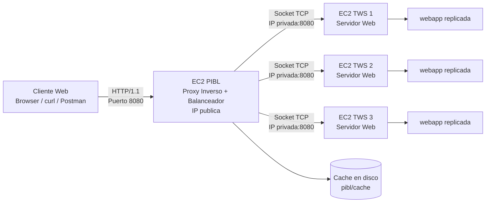
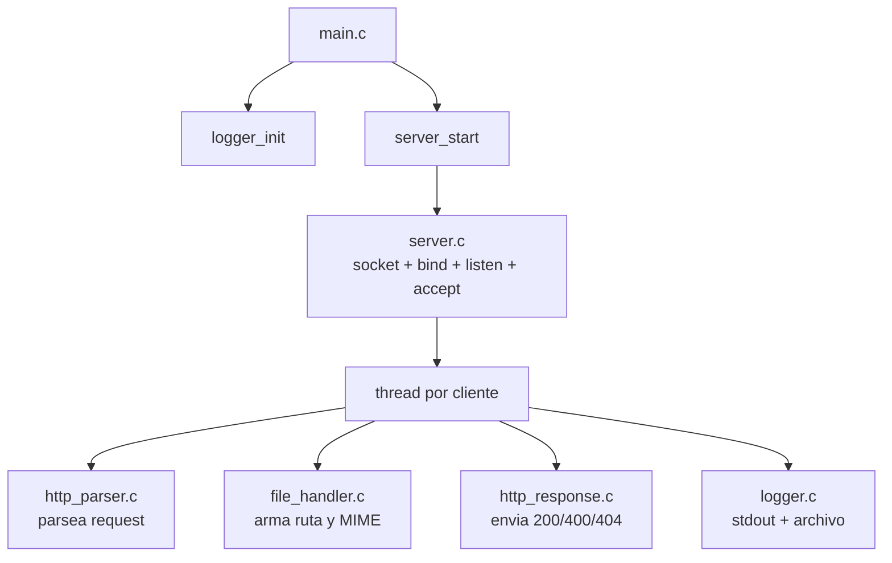
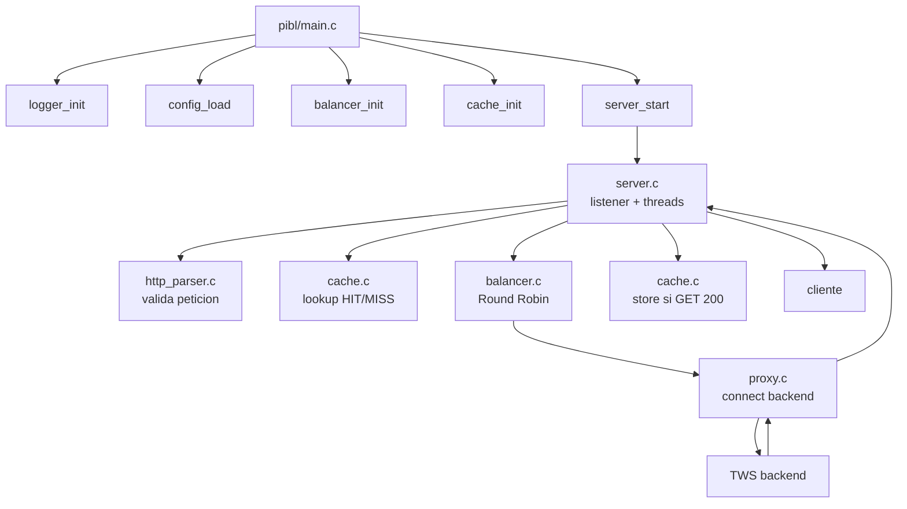
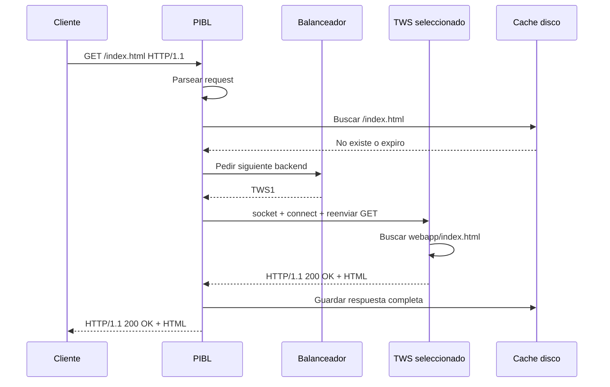
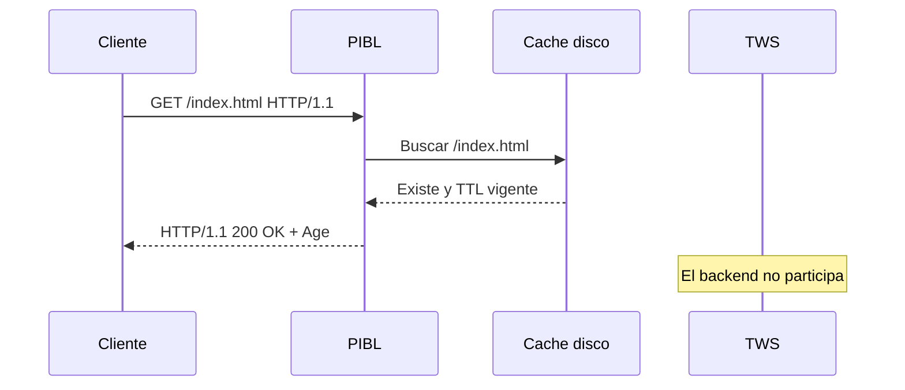
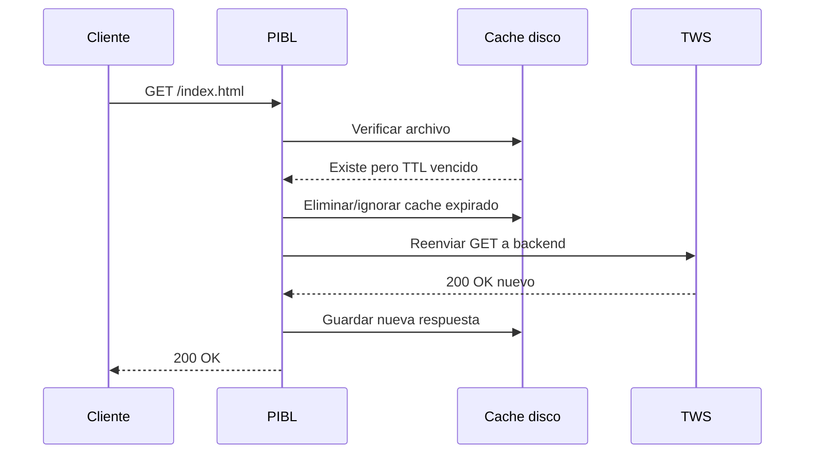
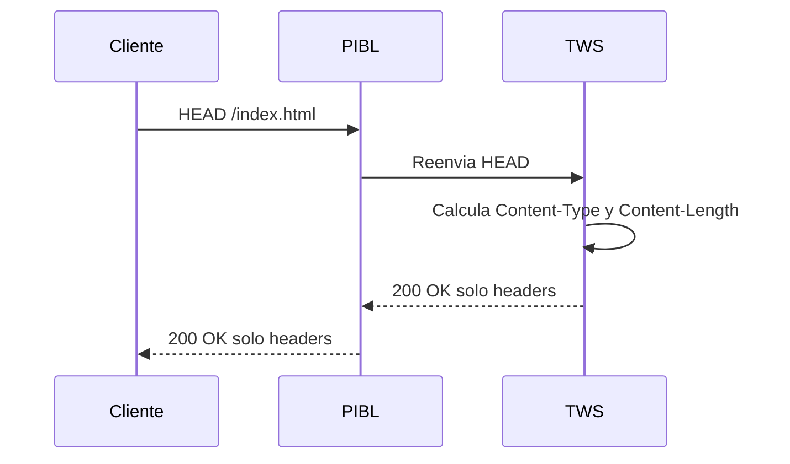
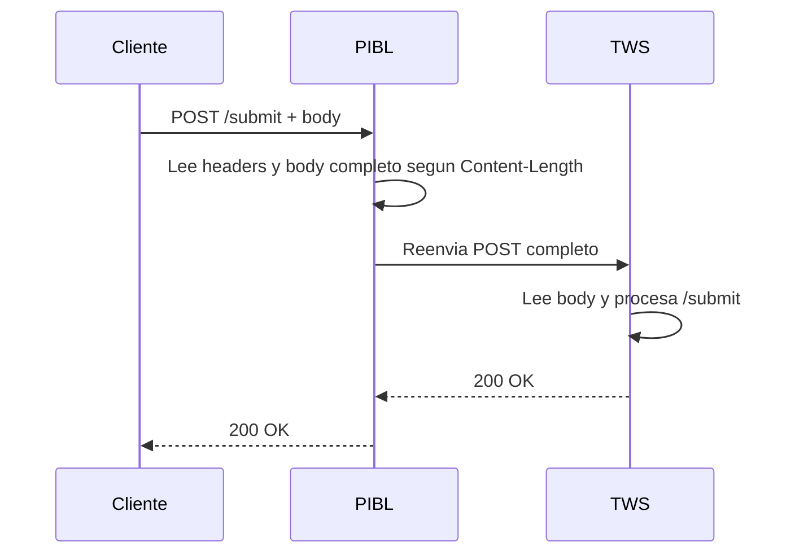
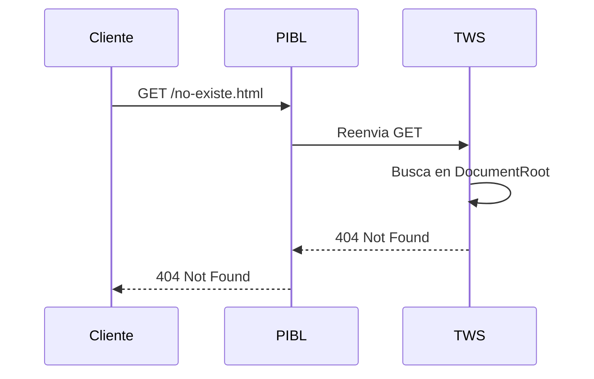
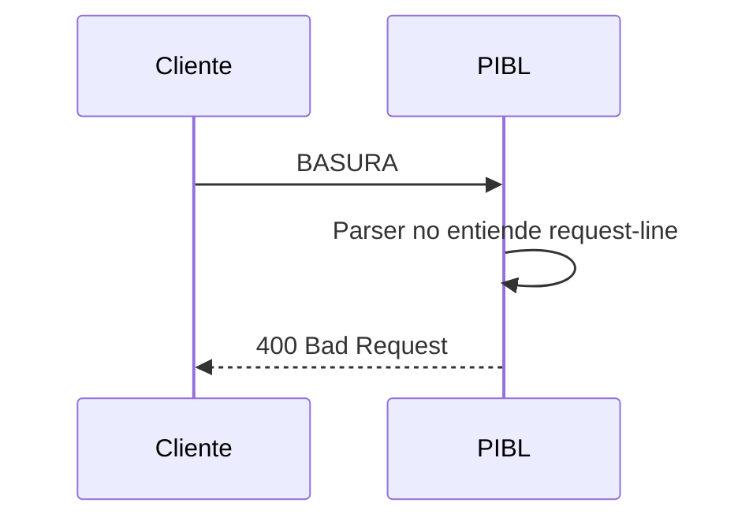

# Exposicion del Proyecto PIBL-WS

Este documento sirve como guia para explicar el proyecto en la sustentacion. Incluye la arquitectura, los componentes, como se conectan los modulos de codigo entre si, los flujos principales, los comandos de ejecucion y las pruebas que se pueden mostrar.

## 1. Idea General del Proyecto

El proyecto implementa una arquitectura web distribuida basada en sockets TCP y HTTP/1.1. El objetivo es construir dos piezas principales:

- **PIBL**: Proxy Inverso + Balanceador de Carga.
- **TWS**: Telematics Web Server, servidor web propio.

El cliente no se conecta directamente a los servidores web. El cliente se conecta al PIBL. El PIBL recibe la peticion HTTP, decide a cual TWS enviarla, reenvia la peticion, espera la respuesta del backend y se la devuelve al cliente.

Adicionalmente, el PIBL implementa cache en disco con TTL. Esto significa que algunas respuestas se guardan en archivos dentro del servidor PIBL. Si otro cliente pide el mismo recurso antes de que expire el TTL, el PIBL puede responder directamente desde disco sin contactar a ningun TWS.

## 2. Arquitectura de Alto Nivel

Segun el PDF y la guia del proyecto, la arquitectura en AWS debe tener cuatro instancias EC2:

- 1 EC2 para el PIBL.
- 3 EC2 para los TWS.



En pruebas locales se simula la misma arquitectura en una sola maquina usando puertos diferentes:

```text
PIBL: 127.0.0.1:8080
TWS1: 127.0.0.1:8081
TWS2: 127.0.0.1:8082
TWS3: 127.0.0.1:8083
```

En AWS, los tres TWS normalmente escuchan en el mismo puerto `8080`, pero en instancias diferentes:

```text
PIBL: IP_PUBLICA:8080
TWS1: IP_PRIVADA_1:8080
TWS2: IP_PRIVADA_2:8080
TWS3: IP_PRIVADA_3:8080
```

## 3. Componentes del Proyecto

La raiz del proyecto esta organizada asi:

```text
Cluster-Web-Telematica/
|-- pibl/        Proxy inverso + balanceador + cache
|-- ws/          Telematics Web Server
|-- webapp/      Aplicacion web de prueba
|-- resources/   PDF y guia de requisitos
|-- README.md    Documentacion general
|-- cambios.md   Cambios implementados
```

## 4. TWS: Telematics Web Server

El TWS es el servidor web que sirve archivos desde una carpeta llamada `DocumentRootFolder`.

Se ejecuta asi:

```bash
./tws <HTTP_PORT> <LogFile> <DocumentRootFolder>
```

Ejemplo:

```bash
cd ws
./tws 8081 logs/tws1.log ../webapp
```

### 4.1 Responsabilidades del TWS

El TWS se encarga de:

- Escuchar conexiones TCP.
- Recibir peticiones HTTP/1.1.
- Parsear los metodos `GET`, `HEAD` y `POST`.
- Validar que exista el header `Host`.
- Servir archivos desde `DocumentRootFolder`.
- Retornar `200 OK` cuando el recurso existe.
- Retornar `400 Bad Request` cuando la peticion es invalida.
- Retornar `404 Not Found` cuando el recurso no existe.
- Registrar peticiones y respuestas en stdout y archivo.
- Manejar multiples clientes concurrentemente usando threads.

### 4.2 Archivos del TWS

```text
ws/src/main.c
ws/src/server.c
ws/src/http_parser.c
ws/src/http_response.c
ws/src/file_handler.c
ws/src/logger.c
```

### 4.3 Como se unen los archivos del TWS



### 4.4 `main.c`

`main.c` es el punto de entrada del TWS.

Hace lo siguiente:

1. Verifica que existan 3 argumentos:
   - puerto
   - archivo de log
   - DocumentRootFolder
2. Valida que el puerto sea numerico.
3. Valida que el DocumentRoot exista.
4. Inicializa el logger.
5. Llama a `server_start(port, doc_root)`.

Ejemplo de explicacion para la exposicion:

> Este archivo no procesa HTTP directamente. Su funcion es preparar el servidor: valida argumentos, abre el log y delega toda la logica de red a `server.c`.

### 4.5 `server.c`

`server.c` contiene la logica de sockets y concurrencia.

Usa el patron recomendado por Beej:

```c
getaddrinfo();
socket();
bind();
listen();
accept();
```

El flujo es:

1. Crea un socket listener.
2. Hace `bind` al puerto indicado.
3. Hace `listen`.
4. Entra en un ciclo infinito con `accept`.
5. Por cada cliente aceptado, crea un thread.
6. El thread ejecuta `handle_client`.

Dentro de `handle_client`:

1. Lee la peticion HTTP.
2. Llama a `http_parse_request`.
3. Si la peticion es invalida, responde 400.
4. Si es `POST /submit`, responde con HTML de confirmacion.
5. Si es `GET` o `HEAD`, busca el archivo solicitado.
6. Si no existe, responde 404.
7. Si existe, responde 200.

### 4.6 `http_parser.c`

Este modulo interpreta la peticion HTTP.

Extrae:

- Metodo: `GET`, `HEAD` o `POST`.
- URI: por ejemplo `/index.html`.
- Version: debe ser `HTTP/1.1`.
- Header `Host`.
- Header `Content-Length`.
- Puntero al body para POST.

Ejemplo de peticion valida:

```http
GET /index.html HTTP/1.1
Host: 127.0.0.1:8080
```

Ejemplo de peticion POST:

```http
POST /submit HTTP/1.1
Host: 127.0.0.1:8080
Content-Type: application/x-www-form-urlencoded
Content-Length: 24

nombre=Juan&mensaje=Hola
```

### 4.7 `file_handler.c`

Este modulo se encarga de archivos.

Funciones principales:

- `file_build_path`: combina `DocumentRootFolder` + URI.
- `file_exists`: verifica si el archivo existe.
- `file_get_size`: obtiene el tamano.
- `file_get_content_type`: determina el MIME type.

Ejemplos:

```text
URI "/"                  -> webapp/index.html
URI "/gallery.html"      -> webapp/gallery.html
URI "/css/style.css"     -> webapp/css/style.css
URI "/img/foto1.jpg"     -> webapp/img/foto1.jpg
URI "/files/archivo_grande.bin" -> webapp/files/archivo_grande.bin
```

Tambien evita path traversal:

```text
/../../../etc/passwd
```

Esa ruta se rechaza porque contiene `..`.

### 4.8 `http_response.c`

Este modulo construye y envia respuestas HTTP.

Casos:

```http
HTTP/1.1 200 OK
Content-Type: text/html
Content-Length: 4087
Connection: close
```

```http
HTTP/1.1 400 Bad Request
Content-Type: text/html
Content-Length: ...
Connection: close
```

```http
HTTP/1.1 404 Not Found
Content-Type: text/html
Content-Length: ...
Connection: close
```

Para archivos grandes, no carga todo el archivo en memoria. Lee y envia en bloques de 4096 bytes.

### 4.9 `logger.c`

El logger del TWS escribe en:

- stdout
- archivo de log

Cada linea incluye timestamp.

Ejemplo:

```text
[2026-05-01 18:32:08] [TWS] 127.0.0.1 -> GET /index.html HTTP/1.1
[2026-05-01 18:32:08] [TWS] 127.0.0.1 <- 200 OK /index.html (4087 bytes)
```

Usa `pthread_mutex_t` para que dos threads no mezclen sus mensajes.

## 5. PIBL: Proxy Inverso + Balanceador + Cache

El PIBL recibe las peticiones del cliente y decide a cual TWS enviarlas.

Se ejecuta asi:

```bash
./pibl <HTTP_PORT> <ConfigFile> <LogFile> <CacheTTL>
```

Ejemplo:

```bash
cd pibl
./pibl 8080 pibl.conf logs/pibl.log 300
```

### 5.1 Responsabilidades del PIBL

El PIBL se encarga de:

- Escuchar conexiones HTTP desde clientes.
- Parsear la peticion HTTP.
- Consultar cache en disco para `GET`.
- Si no hay cache valido, elegir backend por Round Robin.
- Crear un nuevo socket cliente hacia el backend.
- Reenviar la peticion completa al TWS.
- Esperar la respuesta del TWS.
- Insertar header `Via: PIBL/1.0`.
- Guardar en cache respuestas `GET 200 OK`.
- Retornar la respuesta al cliente.
- Registrar logs en stdout y archivo.
- Manejar multiples clientes con threads.

### 5.2 Archivos del PIBL

```text
pibl/src/main.c
pibl/src/server.c
pibl/src/proxy.c
pibl/src/balancer.c
pibl/src/cache.c
pibl/src/config.c
pibl/src/http_parser.c
pibl/src/logger.c
```

### 5.3 Como se unen los archivos del PIBL



### 5.4 `main.c`

`main.c` del PIBL:

1. Lee argumentos:
   - puerto
   - archivo de configuracion
   - archivo de log
   - TTL del cache
2. Inicializa logger.
3. Carga backends con `config_load`.
4. Inicializa Round Robin con `balancer_init`.
5. Inicializa cache con `cache_init`.
6. Arranca servidor con `server_start`.

### 5.5 `config.c`

Lee `pibl.conf`.

Formato:

```text
backend 127.0.0.1 8081
backend 127.0.0.1 8082
backend 127.0.0.1 8083
```

En AWS se reemplaza por IPs privadas:

```text
backend 10.0.1.21 8080
backend 10.0.1.22 8080
backend 10.0.1.23 8080
```

### 5.6 `balancer.c`

Implementa Round Robin.

Si hay 3 backends:

```text
Peticion 1 -> TWS1
Peticion 2 -> TWS2
Peticion 3 -> TWS3
Peticion 4 -> TWS1
Peticion 5 -> TWS2
Peticion 6 -> TWS3
```

Usa:

- `g_current`: indice actual.
- `g_backends`: lista de backends.
- `pthread_mutex_t g_lock`: protege el indice en concurrencia.

La rotacion ocurre asi:

```c
out = &g_backends[g_current];
g_current = (g_current + 1) % g_count;
```

### 5.7 `proxy.c`

Este modulo conecta el PIBL con un backend TWS.

Usa el patron de Beej:

```c
getaddrinfo();
socket();
connect();
```

Flujo:

1. Recibe IP y puerto del backend.
2. Crea socket cliente.
3. Conecta al backend.
4. Reenvia la peticion HTTP completa.
5. Lee la respuesta del backend.
6. Devuelve la respuesta a `server.c`.

Tambien usa timeouts para evitar que un backend caido bloquee indefinidamente.

### 5.8 `cache.c`

El cache se guarda en disco dentro de:

```text
pibl/cache/
```

Ejemplos:

```text
GET /index.html
-> pibl/cache/index.html

GET /css/style.css
-> pibl/cache/css/style.css

GET /files/archivo_grande.bin
-> pibl/cache/files/archivo_grande.bin
```

El cache guarda la respuesta HTTP completa:

```text
HTTP/1.1 200 OK
Via: PIBL/1.0
Content-Type: text/html
Content-Length: ...

<html>...</html>
```

TTL:

- Si `CacheTTL=0`, cache deshabilitado.
- Si `CacheTTL=300`, el recurso vive 300 segundos.
- Se valida usando el tiempo de modificacion del archivo.

Cuando hay cache HIT, el PIBL agrega header:

```http
Age: 2
```

Ese header indica cuantos segundos lleva ese recurso en cache.

### 5.9 `server.c`

`server.c` del PIBL es el centro de la logica.

Flujo simplificado:

```text
Cliente conecta al PIBL
PIBL lee request
PIBL parsea HTTP
Si es GET:
    busca en cache
    si HIT:
        responde desde disco
    si MISS:
        elige backend por Round Robin
        reenvia request
        recibe response
        guarda en cache si es 200
        responde al cliente
Si no es GET:
    elige backend
    reenvia request
    responde al cliente
```

## 6. Webapp

La carpeta `webapp/` contiene los recursos que sirven los TWS.

Casos de prueba:

| Caso | Archivo | Que demuestra |
|---|---|---|
| Caso 1 | `index.html` | HTML + hipertextos + imagen |
| Caso 2 | `gallery.html` | Multiples imagenes |
| Caso 3 | `bigfile.html` + `archivo_grande.bin` | Archivo binario de ~1 MB |
| Caso 4 | `multifiles.html` + `file_part*.bin` | Multiples archivos que suman ~1 MB |
| Extra | `form.html` | POST |
| Extra | `404.html` | Pagina de error |

## 7. Diagramas de Flujo Para Explicar

### 7.1 GET Normal: Cache MISS + Round Robin



Explicacion:

> Esta es la primera vez que se pide el recurso. Como no esta en cache, el PIBL usa Round Robin para escoger un TWS, reenvia la peticion, recibe la respuesta, la guarda en cache y se la devuelve al cliente.

### 7.2 Cache HIT



Explicacion:

> En este caso el PIBL responde directamente desde disco. El TWS no recibe nada, lo que reduce carga en los backends.

### 7.3 Cache Expirado



### 7.4 HEAD



Explicacion:

> HEAD devuelve los mismos headers que GET, pero no envia cuerpo. Sirve para verificar metadatos del recurso.

### 7.5 POST



### 7.6 Error 404



### 7.7 Error 400



## 8. Relacion Con Requisitos Funcionales

| Requisito | Donde se cumple |
|---|---|
| C + Sockets | `ws/src/server.c`, `pibl/src/server.c`, `pibl/src/proxy.c` |
| HTTP/1.1 | `http_parser.c` en TWS y PIBL |
| GET/HEAD/POST | `ws/src/http_parser.c`, `ws/src/server.c` |
| 200/400/404 | `ws/src/http_response.c` |
| Concurrencia | `pthread_create` en TWS y PIBL |
| Logger | `ws/src/logger.c`, `pibl/src/logger.c` |
| Round Robin | `pibl/src/balancer.c` |
| Cache en disco | `pibl/src/cache.c` |
| TTL | `pibl/src/cache.c`, parametro CLI del PIBL |
| Config backends | `pibl/src/config.c`, `pibl/pibl.conf` |
| DocumentRoot | `ws/src/file_handler.c` |
| AWS EC2 | 4 instancias: 1 PIBL + 3 TWS |

## 9. Como Compilar

Estos comandos fueron ejecutados y compilaban correctamente en Linux/WSL:

```bash
cd ws
make clean
make
```

Salida esperada:

```text
rm -f tws
gcc -Wall -Wextra -pthread -o tws src/main.c src/server.c src/http_parser.c src/http_response.c src/file_handler.c src/logger.c
```

Luego:

```bash
cd ../pibl
make clean
make
```

Salida esperada:

```text
rm -f pibl
gcc -Wall -Wextra -pthread -o pibl src/main.c src/server.c src/proxy.c src/balancer.c src/cache.c src/http_parser.c src/config.c src/logger.c
```

## 10. Como Ejecutar En Local

Abrir cuatro terminales.

Terminal 1:

```bash
cd ws
mkdir -p logs
./tws 8081 logs/tws1.log ../webapp
```

Terminal 2:

```bash
cd ws
mkdir -p logs
./tws 8082 logs/tws2.log ../webapp
```

Terminal 3:

```bash
cd ws
mkdir -p logs
./tws 8083 logs/tws3.log ../webapp
```

Terminal 4:

```bash
cd pibl
mkdir -p logs cache
./pibl 8080 pibl.conf logs/pibl.log 300
```

Luego abrir:

```text
http://127.0.0.1:8080/index.html
http://127.0.0.1:8080/gallery.html
http://127.0.0.1:8080/bigfile.html
http://127.0.0.1:8080/multifiles.html
http://127.0.0.1:8080/form.html
```

## 11. Pruebas Para Mostrar En La Exposicion

### 11.1 GET

```bash
curl -v http://127.0.0.1:8080/index.html
```

Debe verse:

```text
HTTP/1.1 200 OK
Via: PIBL/1.0
Content-Type: text/html
Content-Length: 4087
```

### 11.2 HEAD

```bash
curl -I http://127.0.0.1:8080/index.html
```

Debe devolver headers sin body.

### 11.3 POST

```bash
curl -v -X POST http://127.0.0.1:8080/submit \
  -H "Content-Type: application/x-www-form-urlencoded" \
  -d "nombre=Esteban&mensaje=Hola"
```

Debe retornar `200 OK`.

### 11.4 404

```bash
curl -v http://127.0.0.1:8080/no-existe.html
```

Debe retornar:

```text
HTTP/1.1 404 Not Found
```

### 11.5 400

```bash
printf 'BASURA\r\n\r\n' | nc 127.0.0.1 8080
```

Debe retornar:

```text
HTTP/1.1 400 Bad Request
```

### 11.6 Archivo Grande

```bash
curl -o /tmp/archivo_grande.bin http://127.0.0.1:8080/files/archivo_grande.bin
stat -c%s /tmp/archivo_grande.bin
```

Debe mostrar:

```text
1048576
```

### 11.7 Cache HIT/MISS

```bash
rm -f pibl/cache/index.html
curl -I http://127.0.0.1:8080/index.html
curl -I http://127.0.0.1:8080/index.html
tail -n 20 pibl/logs/pibl.log
```

Esperado:

- Primera peticion: `MISS`.
- Segunda peticion: `CACHE HIT`.
- Segunda respuesta: header `Age`.

### 11.8 Round Robin

Para demostrar Round Robin sin que el cache interfiera, se puede arrancar PIBL con TTL 0:

```bash
./pibl 8080 pibl.conf logs/pibl.log 0
```

Luego:

```bash
for i in 1 2 3 4 5 6; do
  curl -s -o /dev/null http://127.0.0.1:8080/gallery.html
done
tail -n 30 pibl/logs/pibl.log
```

Debe verse rotacion entre:

```text
127.0.0.1:8081
127.0.0.1:8082
127.0.0.1:8083
127.0.0.1:8081
```

### 11.9 Failover

Detener uno de los TWS y hacer:

```bash
curl -v http://127.0.0.1:8080/index.html
tail -n 20 pibl/logs/pibl.log
```

Debe verse que el PIBL registra fallo del backend y prueba el siguiente.

### 11.10 Seguridad Path Traversal

```bash
curl -v http://127.0.0.1:8080/../../../etc/passwd
```

Debe retornar `400 Bad Request` o rechazo equivalente.

## 12. Despliegue En AWS

Segun la guia, deben usarse 4 instancias EC2:

```text
EC2 1: PIBL  - IP publica - puerto 8080 expuesto
EC2 2: TWS 1 - IP privada - puerto 8080 interno
EC2 3: TWS 2 - IP privada - puerto 8080 interno
EC2 4: TWS 3 - IP privada - puerto 8080 interno
```

### 12.1 Security Groups

PIBL:

- SSH 22 desde la IP del equipo.
- TCP 8080 desde internet o desde la IP del profesor/equipo.

TWS:

- SSH 22 para administracion.
- TCP 8080 solo desde el Security Group del PIBL o desde la VPC.

### 12.2 Instalacion En Cada EC2

```bash
sudo apt update
sudo apt install -y build-essential git make
git clone <URL_DEL_REPO>
cd Cluster-Web-Telematica
```

### 12.3 En Cada TWS

```bash
cd ws
make clean
make
mkdir -p logs
./tws 8080 logs/tws.log ../webapp
```

### 12.4 En El PIBL

Editar `pibl/pibl.conf`:

```text
backend 10.x.x.x 8080
backend 10.x.x.y 8080
backend 10.x.x.z 8080
```

Luego:

```bash
cd pibl
make clean
make
mkdir -p logs cache
./pibl 8080 pibl.conf logs/pibl.log 300
```

El cliente entra por:

```text
http://IP_PUBLICA_PIBL:8080/index.html
```

## 13. Preguntas Que Pueden Hacer Y Respuestas

### Por que se necesitan 4 EC2?

Porque la arquitectura requiere un servidor PIBL y tres servidores TWS independientes. Esto demuestra balanceo real entre backends distintos.

### Por que no Docker?

No es necesario para cumplir el PDF. El proyecto busca demostrar sockets, threads, HTTP, cache y balanceo sobre EC2. Ejecutar directamente en Ubuntu EC2 es mas transparente para la sustentacion.

### Que pasa si un backend se cae?

El PIBL intenta conectar al backend elegido. Si falla, registra el error y prueba el siguiente backend disponible.

### Que pasa si el cache expira?

El PIBL detecta que el archivo cacheado tiene mas edad que el TTL, lo elimina o lo ignora, consulta nuevamente al backend y guarda una respuesta nueva.

### Por que el cache solo guarda GET 200 OK?

Porque GET es idempotente y representa recursos recuperables. POST puede depender del body enviado y no deberia cachearse de forma simple.

### Como se evita que varios threads rompan el Round Robin?

El indice `g_current` esta protegido con `pthread_mutex_t`, entonces solo un thread a la vez puede leerlo y actualizarlo.

### Como se evita path traversal?

El TWS rechaza URIs con `..` o `\`, por lo que no permite construir rutas fuera del DocumentRoot.

### Como se sabe que HEAD no envia body?

`http_response_200` envia headers, pero si el metodo es `HEAD`, retorna sin leer ni enviar el archivo.

### Como se sabe que el archivo grande no se trunca?

Se descarga con `curl` y se valida con `stat -c%s`. Debe mostrar `1048576`.

## 14. Guion Corto Para Presentar

1. Explicar que el proyecto implementa HTTP/1.1 con sockets en C.
2. Mostrar arquitectura: cliente -> PIBL -> 3 TWS.
3. Explicar que PIBL balancea por Round Robin.
4. Explicar que TWS sirve archivos desde `webapp`.
5. Mostrar flujo GET con cache MISS.
6. Mostrar flujo GET con cache HIT.
7. Mostrar HEAD y POST.
8. Mostrar errores 400 y 404.
9. Mostrar comandos de compilacion.
10. Ejecutar pruebas con `curl`.
11. Mostrar logs de PIBL y TWS.
12. Explicar despliegue AWS con 4 EC2.

## 15. Estado Actual Verificado

Se ejecuto compilacion en Linux/WSL:

```bash
cd ws && make clean && make
cd ../pibl && make clean && make
```

Resultado:

- `ws` compilo correctamente.
- `pibl` compilo correctamente.

Tambien se habia probado previamente:

- GET `200 OK`.
- HEAD con headers correctos.
- POST `/submit` con `200 OK`.
- 404 para recurso inexistente.
- archivo grande con `1048576` bytes.
- cache MISS/HIT con header `Age`.

## 16. Cierre

La idea principal que debe quedar clara en la exposicion es:

> Construimos un mini ecosistema web distribuido en C. El cliente habla con el PIBL; el PIBL decide a que TWS enviar cada peticion, aplica cache cuando puede, y finalmente retorna la respuesta. Los TWS sirven la aplicacion web desde disco, soportan GET/HEAD/POST, registran logs y manejan multiples clientes con threads.

