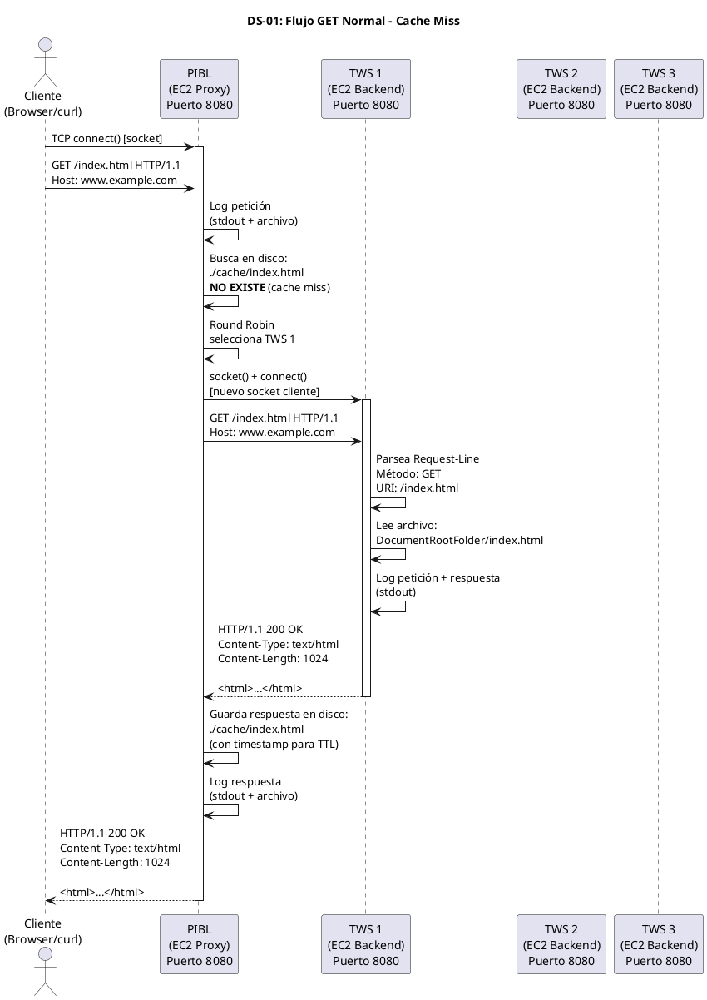
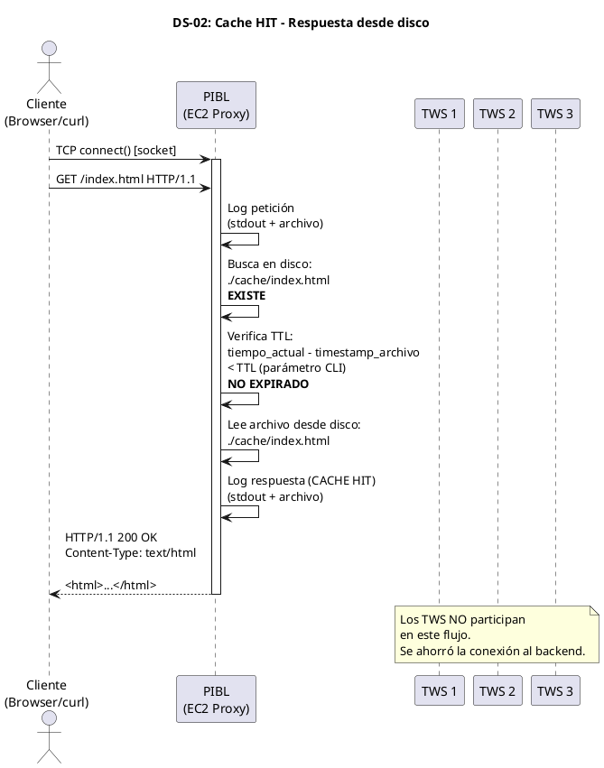
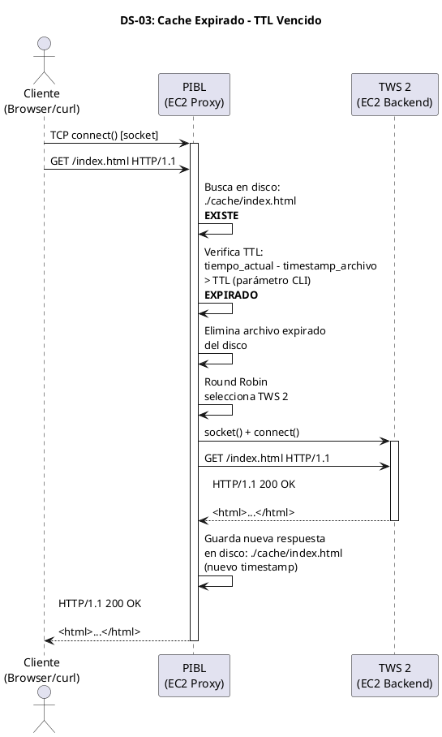
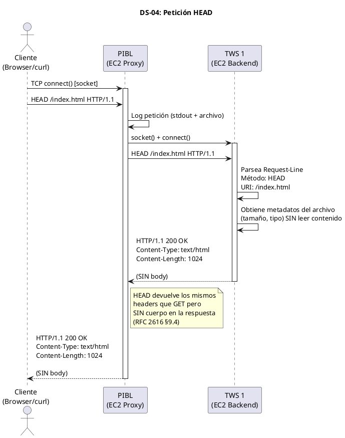
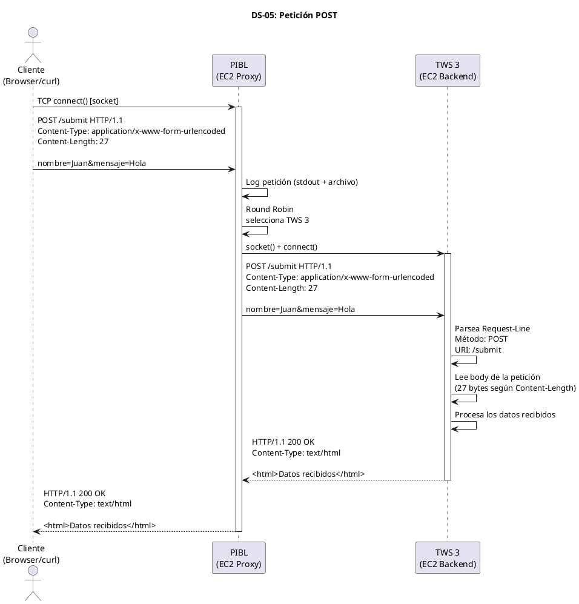
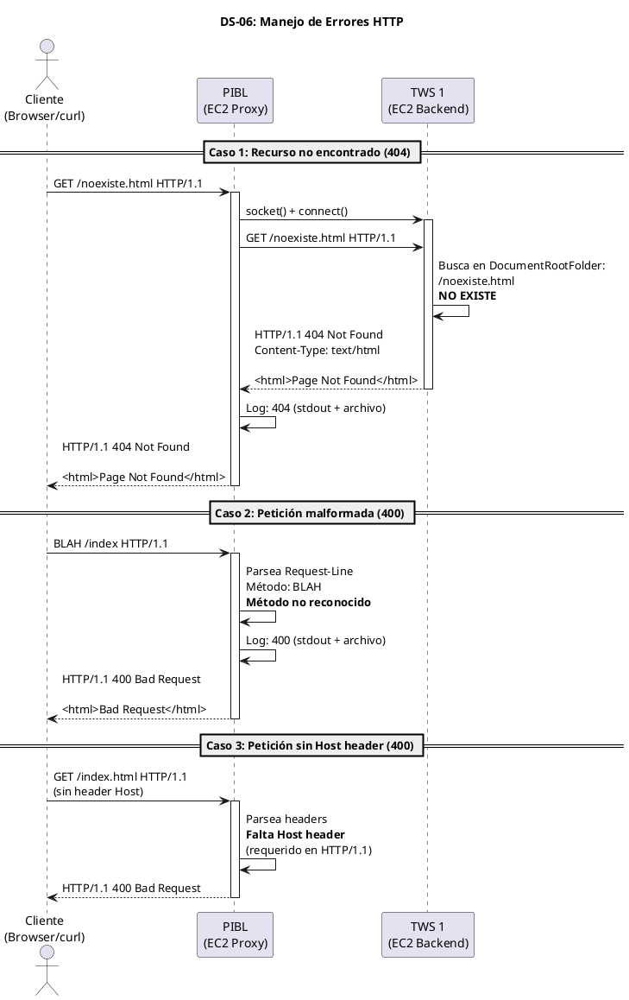

# Guía Completa del Proyecto - Cluster Web Telemática

## 1. Estructura de carpetas del proyecto

```
prueba-cluster/
│
├── README.md                          ← Entrega: Intro, Desarrollo, Conclusiones, Referencias
│
├── docs/                              ← Documentación y diagramas
│   ├── diagramas/
│   │   ├── DS-01-flujo-get-normal.puml
│   │   ├── DS-02-cache-hit.puml
│   │   ├── DS-03-cache-expirado-ttl.puml
│   │   ├── DS-04-peticion-head.puml
│   │   ├── DS-05-peticion-post.puml
│   │   ├── DS-06-errores-http.puml
│   │   └── DS-07-arquitectura-general.puml
│   └── arquitectura.png               ← Diagrama de despliegue AWS
│
├── pibl/                              ← Proxy Inverso + Balanceador de Carga
│   ├── Makefile
│   ├── pibl.conf                      ← Archivo de configuración (puerto + backends)
│   ├── cache/                         ← Directorio donde se almacenan recursos cacheados
│   ├── logs/                          ← Archivos de log
│   └── src/
│       ├── main.c                     ← Punto de entrada, parseo de args CLI
│       ├── server.c / server.h        ← Socket listener, accept, threads
│       ├── proxy.c / proxy.h          ← Lógica de reverse proxy (conectar al backend)
│       ├── balancer.c / balancer.h    ← Round Robin
│       ├── cache.c / cache.h          ← Caché en disco + TTL
│       ├── http_parser.c / http_parser.h  ← Parseo de HTTP request/response
│       ├── logger.c / logger.h        ← Log a stdout + archivo
│       └── config.c / config.h        ← Lectura del archivo de configuración
│
├── tws/                              ← Telematics Web Server
│   ├── Makefile
│   ├── logs/
│   └── src/
│       ├── main.c                     ← Punto de entrada: ./server <PORT> <LogFile> <DocRoot>
│       ├── server.c / server.h        ← Socket listener, accept, threads
│       ├── http_parser.c / http_parser.h  ← Parseo de GET, HEAD, POST
│       ├── http_response.c / http_response.h  ← Generar respuestas 200, 400, 404
│       ├── file_handler.c / file_handler.h    ← Servir archivos del DocumentRootFolder
│       └── logger.c / logger.h        ← Log a stdout + archivo
│
├── webapp/                            ← Aplicación web (la misma se replica en los 3 TWS)
│   ├── index.html                     ← Caso 1: hipertextos + 1 imagen
│   ├── gallery.html                   ← Caso 2: hipertextos + múltiples imágenes
│   ├── bigfile.html                   ← Caso 3: enlace a archivo de ~1MB
│   ├── multifiles.html                ← Caso 4: múltiples archivos ~1MB total
│   ├── css/
│   │   └── style.css
│   ├── img/
│   │   ├── logo.png
│   │   ├── photo1.jpg
│   │   ├── photo2.jpg
│   │   └── photo3.jpg
│   └── files/
│       ├── large_file.bin             ← ~1MB
│       ├── file_part1.bin             ← Varios archivos que suman ~1MB
│       ├── file_part2.bin
│       └── file_part3.bin
│
└── resources/                         ← PDF del proyecto y material de referencia
    └── PDF-ProyectoN1-PILB-WS-v1.0 (1).pdf
```

---

## 2. Requisitos funcionales (corregidos según el PDF)

### PIBL (Proxy Inverso + Balanceador de Carga)

| ID    | Requisito                                                        | Ref PDF      |
|-------|------------------------------------------------------------------|--------------|
| RF-01 | Escrito en C (o Rust) usando API Sockets                         | §5.1, §5.2   |
| RF-02 | Escuchar en puerto 80 u 8080 (configurable)                      | §5.5         |
| RF-03 | Al recibir petición, crear nuevo socket cliente hacia el backend elegido | §5.5   |
| RF-04 | Esperar respuesta del backend y reenviarla al cliente             | §5.6         |
| RF-05 | Concurrencia: manejar múltiples clientes con threads (pthreads)   | §5.3         |
| RF-06 | Soportar HTTP/1.1 (RFC 2616)                                     | §5.4         |
| RF-07 | Log: registrar peticiones y respuestas en stdout + archivo        | §5.7         |
| RF-08 | Caché en disco (directorio donde corre el PIBL)                   | §5.8a, §5.8b |
| RF-09 | TTL del caché: parámetro pasado al lanzar la aplicación           | §5.8c        |
| RF-10 | Balanceo de carga: Round Robin                                    | §5.9         |
| RF-11 | Archivo de configuración: puerto + lista de backends              | §5.10        |

### TWS (Telematics Web Server)

| ID    | Requisito                                                        | Ref PDF      |
|-------|------------------------------------------------------------------|--------------|
| RF-12 | Parsear métodos GET, HEAD, POST                                  | §5.a         |
| RF-13 | Código 200: petición exitosa                                     | §5.a.iii.1   |
| RF-14 | Código 400: petición no procesable                                | §5.a.iii.2   |
| RF-15 | Código 404: recurso no encontrado                                 | §5.a.iii.3   |
| RF-16 | Concurrencia con hilos (threads)                                  | §5.a.iv      |
| RF-17 | Logger: mostrar peticiones y respuestas en terminal               | §5.a.v       |
| RF-18 | CLI: `./server <HTTP PORT> <Log File> <DocumentRootFolder>`       | §5.a.vi      |
| RF-19 | Servir recursos desde DocumentRootFolder                          | §5.a.vi.2    |

---

## 3. Diagramas de secuencia (corregidos y completos)

### DS-01: Flujo GET normal (cache miss + Round Robin)



### DS-02: Cache HIT (lectura desde disco)



### DS-03: Cache expirado (TTL vencido)



### DS-04: Petición HEAD



### DS-05: Petición POST



### DS-06: Errores HTTP (400, 404)



---

## 4. Guía paso a paso para el proyecto

### Fase 1: TWS (Semana 1-2) — Empezar por aquí

El TWS es más simple que el PIBL y te da la base para todo lo demás. Muchos módulos se reutilizan.

#### Paso 1.1 — Socket TCP listener básico

```c
// tws/src/main.c
#include <stdio.h>
#include <stdlib.h>
#include <string.h>
#include <unistd.h>
#include <pthread.h>
#include <sys/socket.h>
#include <netinet/in.h>
#include <arpa/inet.h>

#define BUFFER_SIZE 8192

typedef struct {
    int client_fd;
    char client_ip[INET_ADDRSTRLEN];
    char *doc_root;
    char *log_file;
} client_context_t;

void *handle_client(void *arg);

int main(int argc, char *argv[]) {
    if (argc != 4) {
        fprintf(stderr, "Uso: %s <HTTP_PORT> <LogFile> <DocumentRootFolder>\n", argv[0]);
        return 1;
    }

    int port = atoi(argv[1]);
    char *log_file = argv[2];
    char *doc_root = argv[3];

    int server_fd = socket(AF_INET, SOCK_STREAM, 0);
    if (server_fd < 0) {
        perror("socket");
        return 1;
    }

    int opt = 1;
    setsockopt(server_fd, SOL_SOCKET, SO_REUSEADDR, &opt, sizeof(opt));

    struct sockaddr_in addr = {
        .sin_family = AF_INET,
        .sin_addr.s_addr = INADDR_ANY,
        .sin_port = htons(port)
    };

    if (bind(server_fd, (struct sockaddr *)&addr, sizeof(addr)) < 0) {
        perror("bind");
        close(server_fd);
        return 1;
    }

    if (listen(server_fd, 128) < 0) {
        perror("listen");
        close(server_fd);
        return 1;
    }

    printf("[TWS] Servidor escuchando en puerto %d\n", port);
    printf("[TWS] DocumentRoot: %s\n", doc_root);
    printf("[TWS] LogFile: %s\n", log_file);

    while (1) {
        struct sockaddr_in client_addr;
        socklen_t client_len = sizeof(client_addr);

        int client_fd = accept(server_fd, (struct sockaddr *)&client_addr, &client_len);
        if (client_fd < 0) {
            perror("accept");
            continue;
        }

        client_context_t *ctx = malloc(sizeof(client_context_t));
        ctx->client_fd = client_fd;
        ctx->doc_root = doc_root;
        ctx->log_file = log_file;
        inet_ntop(AF_INET, &client_addr.sin_addr, ctx->client_ip, sizeof(ctx->client_ip));

        pthread_t thread;
        pthread_create(&thread, NULL, handle_client, ctx);
        pthread_detach(thread);
    }

    close(server_fd);
    return 0;
}
```

#### Paso 1.2 — Handler del cliente con parseo HTTP + GET/HEAD/POST

```c
// tws/src/main.c (continuación - función handle_client)

void *handle_client(void *arg) {
    client_context_t *ctx = (client_context_t *)arg;
    char buffer[BUFFER_SIZE];

    ssize_t n = read(ctx->client_fd, buffer, sizeof(buffer) - 1);
    if (n <= 0) {
        close(ctx->client_fd);
        free(ctx);
        return NULL;
    }
    buffer[n] = '\0';

    /* Parsear Request-Line: METHOD URI VERSION */
    char method[8], uri[2048], version[16];
    if (sscanf(buffer, "%7s %2047s %15s", method, uri, version) != 3) {
        char *resp = "HTTP/1.1 400 Bad Request\r\nContent-Length: 11\r\n\r\nBad Request";
        write(ctx->client_fd, resp, strlen(resp));
        close(ctx->client_fd);
        free(ctx);
        return NULL;
    }

    /* Log a stdout */
    printf("[TWS] %s -> %s %s %s\n", ctx->client_ip, method, uri, version);

    /* Construir ruta completa del archivo */
    char filepath[4096];
    if (strcmp(uri, "/") == 0)
        snprintf(filepath, sizeof(filepath), "%s/index.html", ctx->doc_root);
    else
        snprintf(filepath, sizeof(filepath), "%s%s", ctx->doc_root, uri);

    /* Verificar si el archivo existe */
    FILE *file = fopen(filepath, "rb");
    if (!file) {
        char *resp = "HTTP/1.1 404 Not Found\r\n"
                     "Content-Type: text/html\r\n"
                     "Content-Length: 44\r\n"
                     "\r\n"
                     "<html><body>404 - Not Found</body></html>";
        write(ctx->client_fd, resp, strlen(resp));
        printf("[TWS] %s <- 404 Not Found (%s)\n", ctx->client_ip, uri);
        close(ctx->client_fd);
        free(ctx);
        return NULL;
    }

    /* Obtener tamaño del archivo */
    fseek(file, 0, SEEK_END);
    long file_size = ftell(file);
    fseek(file, 0, SEEK_SET);

    /* Determinar Content-Type básico */
    const char *content_type = "application/octet-stream";
    if (strstr(uri, ".html")) content_type = "text/html";
    else if (strstr(uri, ".css")) content_type = "text/css";
    else if (strstr(uri, ".js")) content_type = "application/javascript";
    else if (strstr(uri, ".png")) content_type = "image/png";
    else if (strstr(uri, ".jpg")) content_type = "image/jpeg";
    else if (strstr(uri, ".gif")) content_type = "image/gif";

    /* Enviar headers */
    char header[512];
    int header_len = snprintf(header, sizeof(header),
        "HTTP/1.1 200 OK\r\n"
        "Content-Type: %s\r\n"
        "Content-Length: %ld\r\n"
        "\r\n",
        content_type, file_size);

    write(ctx->client_fd, header, header_len);

    /* GET: enviar body | HEAD: solo headers (ya enviados) */
    if (strcmp(method, "GET") == 0 || strcmp(method, "POST") == 0) {
        char file_buf[4096];
        size_t bytes;
        while ((bytes = fread(file_buf, 1, sizeof(file_buf), file)) > 0) {
            write(ctx->client_fd, file_buf, bytes);
        }
    }
    /* HEAD: no envía body, solo los headers de arriba */

    printf("[TWS] %s <- 200 OK %s (%ld bytes)\n", ctx->client_ip, uri, file_size);

    fclose(file);
    close(ctx->client_fd);
    free(ctx);
    return NULL;
}
```

#### Paso 1.3 — Compilar y probar

```bash
cd tws
gcc -o server src/main.c -lpthread -Wall -Wextra
./server 8080 logs/tws.log ../webapp
```

Probar:

```bash
curl -v http://localhost:8080/index.html
curl -I http://localhost:8080/index.html       # HEAD
curl -X POST http://localhost:8080/submit      # POST
curl http://localhost:8080/noexiste.html        # 404
```

---

### Fase 2: PIBL - Proxy básico (Semana 2-3)

#### Paso 2.1 — Proxy que reenvía a un solo backend (sin balanceo aún)

```c
// pibl/src/main.c - estructura base
// Similar a TWS pero en handle_client:
// 1. Recibe petición del cliente
// 2. Crea socket NUEVO hacia el backend
// 3. Envía la petición al backend
// 4. Lee la respuesta del backend
// 5. Envía la respuesta al cliente

// La parte clave del proxy:
void proxy_forward(int client_fd, const char *backend_host, int backend_port,
                   const char *request, size_t request_len) {

    /* Crear socket hacia el backend */
    int backend_fd = socket(AF_INET, SOCK_STREAM, 0);

    struct sockaddr_in backend_addr = {
        .sin_family = AF_INET,
        .sin_port = htons(backend_port)
    };
    inet_pton(AF_INET, backend_host, &backend_addr.sin_addr);

    if (connect(backend_fd, (struct sockaddr *)&backend_addr, sizeof(backend_addr)) < 0) {
        char *err = "HTTP/1.1 502 Bad Gateway\r\nContent-Length: 11\r\n\r\nBad Gateway";
        write(client_fd, err, strlen(err));
        close(backend_fd);
        return;
    }

    /* Enviar petición del cliente al backend */
    write(backend_fd, request, request_len);

    /* Leer respuesta del backend y reenviarla al cliente */
    char buffer[8192];
    ssize_t n;
    while ((n = read(backend_fd, buffer, sizeof(buffer))) > 0) {
        write(client_fd, buffer, n);
    }

    close(backend_fd);
}
```

#### Paso 2.2 — Round Robin

```c
// pibl/src/balancer.c

typedef struct {
    char host[256];
    int port;
} backend_t;

typedef struct {
    backend_t *backends;
    int count;
    int current;             // índice Round Robin
    pthread_mutex_t lock;
} balancer_t;

backend_t *balancer_next(balancer_t *lb) {
    pthread_mutex_lock(&lb->lock);
    backend_t *b = &lb->backends[lb->current];
    lb->current = (lb->current + 1) % lb->count;
    pthread_mutex_unlock(&lb->lock);
    return b;
}
```

#### Paso 2.3 — Archivo de configuración

```
# pibl/pibl.conf
port=8080
backend=10.0.1.10:8080
backend=10.0.1.11:8080
backend=10.0.1.12:8080
```

---

### Fase 3: Caché en disco + TTL (Semana 3-4)

```c
// pibl/src/cache.c - lógica principal
#include <sys/stat.h>
#include <time.h>

int cache_is_valid(const char *cache_path, int ttl_seconds) {
    struct stat st;
    if (stat(cache_path, &st) != 0)
        return 0;  /* no existe */

    time_t now = time(NULL);
    double age = difftime(now, st.st_mtime);

    return age < ttl_seconds;  /* 1 = válido, 0 = expirado */
}

/* Convertir URI a ruta de caché: /index.html → ./cache/index.html */
void cache_path_from_uri(const char *uri, char *out, size_t out_size) {
    snprintf(out, out_size, "./cache%s", uri);
}
```

Lanzamiento con TTL:

```bash
./pibl --config pibl.conf --ttl 60
```

---

### Fase 4: Logger dual (Semana 3-4)

```c
// pibl/src/logger.c
#include <stdio.h>
#include <stdarg.h>
#include <time.h>
#include <pthread.h>

static FILE *log_fp = NULL;
static pthread_mutex_t log_lock = PTHREAD_MUTEX_INITIALIZER;

void logger_init(const char *filepath) {
    log_fp = fopen(filepath, "a");
}

void logger_log(const char *fmt, ...) {
    pthread_mutex_lock(&log_lock);

    time_t now = time(NULL);
    char time_str[64];
    strftime(time_str, sizeof(time_str), "%Y-%m-%d %H:%M:%S", localtime(&now));

    va_list args;

    /* Escribir a stdout */
    printf("[%s] ", time_str);
    va_start(args, fmt);
    vprintf(fmt, args);
    va_end(args);
    printf("\n");

    /* Escribir a archivo */
    if (log_fp) {
        fprintf(log_fp, "[%s] ", time_str);
        va_start(args, fmt);
        vfprintf(log_fp, fmt, args);
        va_end(args);
        fprintf(log_fp, "\n");
        fflush(log_fp);
    }

    pthread_mutex_unlock(&log_lock);
}
```

---

### Fase 5: Webapp + casos de prueba (Semana 4)

Crear las 4 páginas de prueba en `webapp/`.

---

### Fase 6: Despliegue en AWS (Semana 4-5)

```
EC2 Instance 1: PIBL          (IP pública, puerto 8080)
EC2 Instance 2: TWS 1         (IP privada, puerto 8080)
EC2 Instance 3: TWS 2         (IP privada, puerto 8080)
EC2 Instance 4: TWS 3         (IP privada, puerto 8080)
```

---

### Fase 7: Documentación + README.md (Semana 5)

---

## 5. Orden de implementación recomendado

### Semana 1 (Mar 26 - Abr 1)

```
├── Persona A: TWS socket + threads + GET
├── Persona B: HTTP parser (Request-Line + headers)
└── Persona C: Webapp (4 páginas de prueba) + estructura del proyecto
```

### Semana 2 (Abr 2 - Abr 8)

```
├── Persona A: TWS completo (HEAD, POST, 400, 404)
├── Persona B: PIBL socket + proxy básico (forward a 1 backend)
└── Persona C: Logger (stdout + archivo) compartido TWS/PIBL
```

### Semana 3 (Abr 9 - Abr 15)

```
├── Persona A: PIBL Round Robin + archivo de configuración
├── Persona B: PIBL Caché en disco + TTL
└── Persona C: Testing local (curl, telnet, browser)
```

### Semana 4 (Abr 16 - Abr 22)

```
├── Todos: Despliegue en AWS EC2 (4 instancias)
├── Todos: Testing en AWS con los 4 casos de prueba
└── Todos: Fix bugs
```

### Semana 5 (Abr 23 - May 6)

```
├── Todos: README.md (Introducción, Desarrollo, Conclusiones, Referencias)
├── Todos: Diagramas finales
└── Todos: Preparar sustentación (40 min)
```

---

## 6. Primer comando para empezar ahora

Cuando estés listo para empezar a codificar, cambia a modo Agent y te ayudo a crear toda la estructura de carpetas y el código base del TWS. El primer paso concreto sería:

1. **Crear la estructura de carpetas**
2. **Crear `tws/src/main.c`** con el socket + threads + parseo GET
3. **Crear `webapp/index.html`** básico para probar
4. **Compilar y probar con curl**

Todo lo anterior son las piezas del código que te mostré arriba, pero integradas correctamente con los Makefiles y la estructura del proyecto.

---

## 7. GitHub Project — Issues organizados por requisito

> Cada issue está listo para copiar a GitHub Projects.
> Formato: Título, Descripción, Criterios de Aceptación, Dependencias, Labels sugeridos.

---

### RF-01 — Lenguaje C con API Sockets

**Descripción:**
Todo el código del PIBL y del TWS debe estar escrito en lenguaje C utilizando la API BSD Sockets para toda la comunicación de red. No se permite el uso de librerías HTTP de alto nivel (libcurl, libmicrohttpd, etc). Las únicas librerías permitidas son las del sistema: `sys/socket.h`, `netinet/in.h`, `arpa/inet.h`, `pthread.h` y las estándar de C (`stdio`, `stdlib`, `string`, etc).

**Criterios de aceptación:**
- [ ] Todo el código fuente es `.c` y `.h`
- [ ] Se compila con `gcc` sin errores ni warnings (`-Wall -Wextra`)
- [ ] La comunicación de red usa exclusivamente `socket()`, `bind()`, `listen()`, `accept()`, `connect()`, `read()`, `write()`, `close()`
- [ ] No hay dependencias externas más allá de libc y pthreads
- [ ] Compila exitosamente en Linux (Ubuntu en EC2)

**Depende de:** Ninguno (es transversal)
**Bloquea a:** Todos los demás requisitos
**Labels:** `setup`, `transversal`, `prioridad-alta`

---

### RF-02 — PIBL escucha en puerto configurable (80/8080)

**Descripción:**
El PIBL debe crear un socket TCP servidor que escuche en un puerto configurable. El puerto se especifica como primer argumento de la línea de comandos al ejecutar la aplicación. El valor por defecto sugerido es 8080.

**Criterios de aceptación:**
- [ ] `./pibl 8080 pibl.conf logs/pibl.log 300` inicia el servidor en el puerto 8080
- [ ] `./pibl 80 pibl.conf logs/pibl.log 300` inicia el servidor en el puerto 80
- [ ] Si el puerto está ocupado, muestra un error claro (`"Error: puerto 8080 en uso"`)
- [ ] El servidor acepta conexiones TCP de cualquier IP (`INADDR_ANY`)
- [ ] `SO_REUSEADDR` está habilitado para evitar "Address already in use"
- [ ] El servidor permanece escuchando indefinidamente (loop infinito en `accept()`)

**Depende de:** RF-01, RF-11
**Bloquea a:** RF-03, RF-05
**Labels:** `pibl`, `networking`, `semana-2`
**Archivos:** `pibl/src/main.c`, `pibl/src/server.c`

---

### RF-03 — PIBL crea socket cliente hacia backend elegido

**Descripción:**
Cuando el PIBL recibe una petición HTTP de un cliente, debe crear un **nuevo** socket TCP (socket cliente) para conectarse al servidor backend seleccionado por el balanceador. Este socket es independiente del socket del cliente original. El PIBL actúa como intermediario: recibe del cliente → abre conexión al backend → reenvía la petición.

**Criterios de aceptación:**
- [ ] Por cada petición del cliente, se crea un `socket(AF_INET, SOCK_STREAM, 0)` nuevo hacia el backend
- [ ] Se usa `connect()` con la IP y puerto del backend seleccionado
- [ ] Se configura timeout de conexión (5 segundos) con `SO_RCVTIMEO` / `SO_SNDTIMEO`
- [ ] Si `connect()` falla (backend caído), se retorna error y se intenta otro backend
- [ ] La petición original del cliente se reenvía íntegra al backend con `write()`
- [ ] El socket al backend se cierra después de recibir la respuesta

**Depende de:** RF-02, RF-10
**Bloquea a:** RF-04
**Labels:** `pibl`, `networking`, `proxy`, `semana-2`
**Archivos:** `pibl/src/proxy.c`

---

### RF-04 — PIBL espera respuesta del backend y reenvía al cliente

**Descripción:**
Después de enviar la petición al backend, el PIBL debe esperar la respuesta HTTP completa del backend y reenviarla tal cual al cliente original. El PIBL es transparente: no modifica el contenido de la respuesta (excepto agregar headers como `Via`).

**Criterios de aceptación:**
- [ ] El PIBL lee la respuesta completa del backend con `read()` en loop
- [ ] Detecta el fin de la respuesta por Content-Length o cierre de conexión
- [ ] Reenvía la respuesta completa al cliente con `write()` en loop
- [ ] Para archivos grandes (~1MB), la respuesta se reenvía en bloques de 4096 bytes sin cortar
- [ ] El cliente recibe exactamente los mismos bytes que envió el backend
- [ ] Se verifica con: `curl -o output.bin http://PIBL_IP:8080/files/large_file.bin` y comparar tamaño

**Depende de:** RF-03
**Bloquea a:** RF-08 (caché necesita la respuesta para almacenarla)
**Labels:** `pibl`, `networking`, `proxy`, `semana-2`
**Archivos:** `pibl/src/proxy.c`, `pibl/src/server.c`

---

### RF-05 — PIBL concurrencia con pthreads

**Descripción:**
El PIBL debe manejar múltiples clientes simultáneamente. Cada vez que `accept()` acepta una nueva conexión, se debe crear un thread (`pthread_create`) dedicado a manejar esa conexión. El thread principal (main) solo hace `accept()` en loop. El PDF especifica "Thread Based" como estrategia de concurrencia.

**Criterios de aceptación:**
- [ ] Cada conexión se maneja en un `pthread` separado
- [ ] Se usa `pthread_create()` + `pthread_detach()` (no join)
- [ ] El contexto del cliente (fd, ip, etc.) se pasa al thread vía `malloc()` + struct
- [ ] El thread libera la memoria del contexto (`free()`) y cierra el socket al terminar
- [ ] Se pueden manejar al menos 10 conexiones simultáneas sin bloqueo
- [ ] Probar con: `ab -n 100 -c 10 http://PIBL_IP:8080/index.html` (Apache Bench)

**Depende de:** RF-02
**Bloquea a:** RF-10 (Round Robin necesita ser thread-safe)
**Labels:** `pibl`, `concurrencia`, `semana-2`
**Archivos:** `pibl/src/server.c`

---

### RF-06 — Soporte HTTP/1.1 (RFC 2616)

**Descripción:**
Tanto el PIBL como el TWS deben procesar peticiones y respuestas bajo el protocolo HTTP/1.1 definido en el RFC 2616. Esto incluye: parsear la Request-Line (`METHOD URI HTTP/1.1`), parsear headers (`Host`, `Content-Length`, `Content-Type`), respetar terminadores CRLF (`\r\n`), y manejar la separación headers/body (`\r\n\r\n`).

**Criterios de aceptación:**
- [ ] Parsea correctamente la Request-Line: `METHOD SP URI SP HTTP/1.1 CRLF`
- [ ] Extrae los headers relevantes: `Host`, `Content-Length`, `Content-Type`
- [ ] Las respuestas incluyen la Status-Line: `HTTP/1.1 CODE REASON CRLF`
- [ ] Cada header termina en `\r\n` y los headers se separan del body con `\r\n\r\n`
- [ ] Rechaza peticiones sin header `Host` (obligatorio en HTTP/1.1) con 400
- [ ] Funciona con `curl -v`, `telnet`, browsers, Postman

**Depende de:** RF-01
**Bloquea a:** RF-12, RF-13, RF-14, RF-15
**Labels:** `pibl`, `tws`, `http`, `transversal`, `semana-1`
**Archivos:** `pibl/src/http_parser.c`, `ws/src/http_parser.c`

---

### RF-07 — PIBL Logger dual (stdout + archivo)

**Descripción:**
El PIBL debe registrar todas las peticiones recibidas y las respuestas enviadas. El log debe escribirse simultáneamente a la salida estándar (stdout/terminal) y a un archivo de log. La ruta del archivo de log se recibe como argumento CLI. El logger debe ser thread-safe (múltiples threads escriben al log).

**Criterios de aceptación:**
- [ ] Cada petición se muestra en stdout con timestamp, IP cliente, método, URI
- [ ] Cada respuesta se muestra con código de estado y si fue cache HIT/MISS
- [ ] El mismo contenido se escribe al archivo de log especificado en CLI
- [ ] El archivo de log se abre en modo append (`"a"`)
- [ ] Escrituras protegidas con `pthread_mutex_t` (thread-safe)
- [ ] `fflush()` después de cada escritura para no perder logs si crashea
- [ ] Formato: `[2026-03-31 14:30:45] 192.168.1.5 → GET /index.html → 200 OK → MISS`

**Depende de:** RF-05
**Bloquea a:** Ninguno
**Labels:** `pibl`, `logging`, `semana-3`
**Archivos:** `pibl/src/logger.c`, `pibl/src/logger.h`

---

### RF-08 — PIBL caché en disco

**Descripción:**
El PIBL debe cachear las respuestas de los backends en el sistema de archivos (disco). Cuando llega una petición, antes de reenviarla al backend, el PIBL debe verificar si existe una copia cacheada en disco. Si existe y no ha expirado (ver RF-09), se sirve desde disco. Si no existe o expiró, se pide al backend y se guarda la respuesta en disco para futuras peticiones. Los archivos de caché se almacenan en el directorio donde se ejecuta el PIBL (subcarpeta `cache/`).

**Criterios de aceptación:**
- [ ] Primera petición a `/index.html` → cache MISS → pide al backend → guarda en `cache/index.html`
- [ ] Segunda petición a `/index.html` → cache HIT → sirve desde `cache/index.html` (no contacta backend)
- [ ] El archivo cacheado contiene la respuesta HTTP completa (headers + body)
- [ ] Se crean subdirectorios si es necesario: `/css/style.css` → `cache/css/style.css`
- [ ] Si el caché está deshabilitado (TTL=0), siempre se consulta al backend
- [ ] Verificar con logs: primera petición muestra MISS, segunda muestra HIT
- [ ] Los archivos persisten después de reiniciar el PIBL (están en disco)

**Depende de:** RF-04, RF-09
**Bloquea a:** Ninguno
**Labels:** `pibl`, `cache`, `semana-3`
**Archivos:** `pibl/src/cache.c`, `pibl/src/cache.h`

---

### RF-09 — TTL del caché como parámetro CLI

**Descripción:**
El tiempo de vida (Time-To-Live) del caché debe ser un parámetro que se pasa al lanzar la aplicación PIBL por línea de comandos. El TTL indica cuántos segundos una respuesta cacheada se considera válida. Pasado ese tiempo, la entrada de caché se considera expirada y se debe solicitar nuevamente al backend. Si el TTL es 0, el caché queda completamente deshabilitado.

**Criterios de aceptación:**
- [ ] `./pibl 8080 pibl.conf logs/pibl.log 300` → caché con TTL de 5 minutos
- [ ] `./pibl 8080 pibl.conf logs/pibl.log 0` → caché deshabilitado (siempre va al backend)
- [ ] La validez se verifica con: `time(NULL) - stat(archivo).st_mtime < TTL`
- [ ] Si el archivo cacheado tiene más de TTL segundos → se elimina/ignora y se pide al backend
- [ ] Después de re-pedir al backend, se actualiza el archivo en disco (nuevo timestamp)
- [ ] El header `Age` en la respuesta refleja la edad del recurso cacheado

**Depende de:** RF-08
**Bloquea a:** Ninguno
**Labels:** `pibl`, `cache`, `semana-3`
**Archivos:** `pibl/src/cache.c`, `pibl/src/main.c`

---

### RF-10 — Balanceo de carga Round Robin

**Descripción:**
El PIBL debe distribuir las peticiones entrantes entre los backends (mínimo 3) usando el algoritmo Round Robin. Esto significa rotación circular: la primera petición va al backend 1, la segunda al backend 2, la tercera al backend 3, la cuarta al backend 1, y así sucesivamente. El índice de rotación debe ser protegido con mutex porque múltiples threads acceden a él simultáneamente.

**Criterios de aceptación:**
- [ ] Con 3 backends configurados, las peticiones se distribuyen: 1→2→3→1→2→3...
- [ ] El índice `current` está protegido con `pthread_mutex_t`
- [ ] Los backends se cargan desde el archivo de configuración (RF-11)
- [ ] Mínimo 3 backends configurados
- [ ] Verificar distribución con logs: `"→ TWS1"`, `"→ TWS2"`, `"→ TWS3"`, `"→ TWS1"`...
- [ ] Si un backend falla (connect timeout), se intenta con el siguiente (failover)

**Depende de:** RF-05, RF-11
**Bloquea a:** RF-03
**Labels:** `pibl`, `balanceo`, `semana-3`
**Archivos:** `pibl/src/balancer.c`, `pibl/src/balancer.h`

---

### RF-11 — Archivo de configuración del PIBL

**Descripción:**
El PIBL debe leer su configuración desde un archivo de texto plano (`pibl.conf`). Este archivo define la lista de servidores backend (IP y puerto de cada uno). La ruta del archivo de configuración se pasa como segundo argumento CLI. El formato es una línea por backend: `backend <IP> <PORT>`. Las líneas que empiecen con `#` son comentarios y se ignoran.

**Criterios de aceptación:**
- [ ] `./pibl 8080 pibl.conf logs/pibl.log 300` → lee `pibl.conf`
- [ ] Parsea correctamente líneas con formato `backend 10.0.1.10 8080`
- [ ] Ignora líneas vacías y líneas que empiecen con `#`
- [ ] Si el archivo no existe → error claro y aborta
- [ ] Si hay menos de 3 backends → warning en log pero continúa
- [ ] Las IPs y puertos se guardan en un array de structs `backend_t`
- [ ] El archivo se lee una sola vez al inicio (no se recarga en caliente)

**Depende de:** RF-01
**Bloquea a:** RF-02, RF-10
**Labels:** `pibl`, `config`, `semana-2`
**Archivos:** `pibl/src/config.c`, `pibl/src/config.h`, `pibl/pibl.conf`

---

### RF-12 — TWS parsea métodos GET, HEAD, POST

**Descripción:**
El TWS debe ser capaz de parsear la Request-Line de una petición HTTP y extraer el método (`GET`, `HEAD` o `POST`), la URI del recurso y la versión del protocolo. Cada método tiene un comportamiento diferente: GET retorna headers + body, HEAD retorna solo headers (mismo que GET pero sin body), POST recibe datos en el body de la petición y los procesa.

**Criterios de aceptación:**
- [ ] `GET /index.html HTTP/1.1` → extrae method="GET", uri="/index.html", version="HTTP/1.1"
- [ ] `HEAD /index.html HTTP/1.1` → extrae method="HEAD"
- [ ] `POST /submit HTTP/1.1` → extrae method="POST" + lee body según Content-Length
- [ ] Si el método no es GET, HEAD ni POST → responde 400 Bad Request
- [ ] Si la Request-Line no tiene 3 partes → responde 400 Bad Request
- [ ] Probar con:
  - `curl http://IP:8080/index.html` (GET)
  - `curl -I http://IP:8080/index.html` (HEAD)
  - `curl -X POST -d "data=test" http://IP:8080/submit` (POST)

**Depende de:** RF-06, RF-18
**Bloquea a:** RF-13, RF-14, RF-15
**Labels:** `tws`, `http`, `parser`, `semana-1`
**Archivos:** `ws/src/http_parser.c`, `ws/src/http_parser.h`

---

### RF-13 — TWS respuesta 200 OK

**Descripción:**
Cuando una petición es válida y el recurso solicitado existe en el `DocumentRootFolder`, el TWS debe responder con código 200 OK. La respuesta debe incluir los headers `Content-Type` (según la extensión del archivo) y `Content-Length` (tamaño exacto en bytes). Para GET y POST, se incluye el contenido del archivo como body. Para HEAD, solo se envían los headers sin body.

**Criterios de aceptación:**
- [ ] `GET /index.html` donde el archivo existe → `HTTP/1.1 200 OK`
- [ ] Header `Content-Type: text/html` para .html, `image/jpeg` para .jpg, etc.
- [ ] Header `Content-Length` coincide con el tamaño real del archivo (`stat()`)
- [ ] Body contiene el contenido exacto del archivo (GET/POST)
- [ ] HEAD retorna los mismos headers que GET pero con body vacío
- [ ] Archivos grandes (~1MB) se envían completos sin truncar
- [ ] Probar: `curl -o test.html http://IP:8080/index.html && diff test.html webapp/index.html`

**Depende de:** RF-12, RF-19
**Bloquea a:** Ninguno
**Labels:** `tws`, `http`, `response`, `semana-1`
**Archivos:** `ws/src/http_response.c`, `ws/src/file_handler.c`

---

### RF-14 — TWS respuesta 400 Bad Request

**Descripción:**
Cuando el TWS recibe una petición que no puede procesar (método desconocido, Request-Line malformada, falta header Host obligatorio en HTTP/1.1, o cualquier otro error de formato), debe responder con código 400 Bad Request e incluir un body HTML simple explicando el error.

**Criterios de aceptación:**
- [ ] Petición con método inválido (`BLAH /index.html HTTP/1.1`) → 400
- [ ] Request-Line incompleta (`GET HTTP/1.1` sin URI) → 400
- [ ] Petición sin header `Host` en HTTP/1.1 → 400
- [ ] Petición con basura/texto aleatorio → 400
- [ ] La respuesta incluye `Content-Type: text/html` y un body HTML descriptivo
- [ ] Se registra en el log
- [ ] Probar: `echo "BASURA" | nc IP 8080`

**Depende de:** RF-12
**Bloquea a:** Ninguno
**Labels:** `tws`, `http`, `errores`, `semana-1`
**Archivos:** `ws/src/http_response.c`

---

### RF-15 — TWS respuesta 404 Not Found

**Descripción:**
Cuando el TWS recibe una petición válida pero el recurso solicitado no existe en el `DocumentRootFolder`, debe responder con código 404 Not Found. La respuesta debe incluir un body HTML indicando que el recurso no fue encontrado.

**Criterios de aceptación:**
- [ ] `GET /noexiste.html` donde el archivo no existe → `HTTP/1.1 404 Not Found`
- [ ] La respuesta incluye `Content-Type: text/html` y un body HTML
- [ ] El body dice algo como "404 - Page Not Found"
- [ ] Se registra en el log con la URI que no se encontró
- [ ] `HEAD /noexiste.html` → 404 sin body
- [ ] Probar: `curl -v http://IP:8080/pagina_que_no_existe.html`

**Depende de:** RF-12, RF-19
**Bloquea a:** Ninguno
**Labels:** `tws`, `http`, `errores`, `semana-1`
**Archivos:** `ws/src/http_response.c`, `ws/src/file_handler.c`

---

### RF-16 — TWS concurrencia con threads

**Descripción:**
El TWS debe manejar múltiples peticiones de clientes simultáneamente usando threads (pthreads). Cada conexión aceptada por `accept()` se delega a un nuevo thread que ejecuta `handle_client()`. Idéntica estrategia que el PIBL (RF-05). El thread principal solo hace accept() en loop.

**Criterios de aceptación:**
- [ ] Cada conexión se maneja en un `pthread` separado
- [ ] `pthread_create()` + `pthread_detach()` por cada conexión
- [ ] El contexto (fd, ip, doc_root) se pasa al thread vía struct + malloc
- [ ] El thread hace `free()` del contexto y `close()` del fd al terminar
- [ ] Múltiples clientes simultáneos no se bloquean entre sí
- [ ] Probar: abrir página `multifiles.html` en browser (carga múltiples recursos en paralelo)

**Depende de:** RF-18
**Bloquea a:** RF-17
**Labels:** `tws`, `concurrencia`, `semana-1`
**Archivos:** `ws/src/server.c`

---

### RF-17 — TWS Logger (stdout)

**Descripción:**
El TWS debe mostrar en la terminal (stdout) todas las peticiones HTTP entrantes y las respuestas enviadas. Esto incluye: IP del cliente, método, URI solicitada, código de respuesta, y tamaño del archivo servido. También debe escribir al archivo de log especificado en CLI.

**Criterios de aceptación:**
- [ ] Cada petición se imprime: `[TWS] 192.168.1.5 → GET /index.html HTTP/1.1`
- [ ] Cada respuesta se imprime: `[TWS] 192.168.1.5 ← 200 OK /index.html (1024 bytes)`
- [ ] Los errores se imprimen: `[TWS] 192.168.1.5 ← 404 Not Found /noexiste.html`
- [ ] Incluye timestamp: `[2026-03-31 14:30:45]`
- [ ] Se escribe a stdout Y al archivo de log (dual)
- [ ] Thread-safe con mutex
- [ ] `fflush()` después de cada escritura

**Depende de:** RF-16
**Bloquea a:** Ninguno
**Labels:** `tws`, `logging`, `semana-2`
**Archivos:** `ws/src/logger.c`, `ws/src/logger.h`

---

### RF-18 — TWS ejecución CLI con argumentos

**Descripción:**
El TWS se ejecuta desde la línea de comandos con exactamente 3 argumentos: `./server <HTTP_PORT> <LogFile> <DocumentRootFolder>`. El programa debe validar que los 3 argumentos están presentes, que el puerto es un número válido, y que el DocumentRootFolder existe y es un directorio accesible.

**Criterios de aceptación:**
- [ ] `./tws 8080 logs/tws.log ../webapp` inicia correctamente
- [ ] Si faltan argumentos → imprime uso correcto y termina con exit(1)
- [ ] Si el puerto no es un número → error descriptivo
- [ ] Si DocumentRootFolder no existe → error descriptivo y aborta
- [ ] El servidor imprime al iniciar: puerto, ruta de log, ruta de DocumentRoot
- [ ] Funciona con rutas absolutas y relativas para DocumentRootFolder

**Depende de:** RF-01
**Bloquea a:** RF-12, RF-16, RF-19
**Labels:** `tws`, `cli`, `setup`, `semana-1`
**Archivos:** `ws/src/main.c`

---

### RF-19 — TWS sirve archivos desde DocumentRootFolder

**Descripción:**
El TWS debe servir archivos estáticos desde el directorio especificado como `DocumentRootFolder`. Cuando recibe un GET, construye la ruta completa concatenando el DocumentRoot con la URI. Si la URI es `/`, resuelve a `/index.html`. Debe determinar el Content-Type correcto según la extensión del archivo y prevenir ataques de path traversal (URIs con `..`).

**Criterios de aceptación:**
- [ ] `GET /` → sirve `DocumentRootFolder/index.html`
- [ ] `GET /gallery.html` → sirve `DocumentRootFolder/gallery.html`
- [ ] `GET /css/style.css` → sirve `DocumentRootFolder/css/style.css` con `Content-Type: text/css`
- [ ] `GET /img/foto1.jpg` → sirve con `Content-Type: image/jpeg`
- [ ] `GET /files/large_file.bin` → sirve archivo de ~1MB completo
- [ ] `GET /../../../etc/passwd` → **rechazado** (sanitización, responde 400 o 404)
- [ ] MIME types soportados: html, css, js, jpg, png, gif, txt, octet-stream (default)

**Depende de:** RF-18, RF-12
**Bloquea a:** RF-13, RF-15
**Labels:** `tws`, `filesystem`, `semana-1`
**Archivos:** `ws/src/file_handler.c`, `ws/src/file_handler.h`

---

### RF-20 — Webapp: 4 casos de prueba

**Descripción:**
Se deben crear 4 páginas web de prueba que validen diferentes escenarios de carga del servidor. Estas páginas se alojan en `webapp/` y se replican en los 3 servidores TWS. Cada caso prueba un aspecto diferente: contenido básico, múltiples imágenes, archivo grande, y múltiples archivos.

**Criterios de aceptación:**
- [ ] **Caso 1** (`index.html`): Página con hipertextos + 1 imagen → carga correcta
- [ ] **Caso 2** (`gallery.html`): Página con hipertextos + múltiples imágenes → todas cargan
- [ ] **Caso 3** (`bigfile.html`): Enlace a un archivo de ~1MB → descarga completa sin cortar
- [ ] **Caso 4** (`multifiles.html`): Múltiples archivos que suman ~1MB → todos cargan
- [ ] Todas las páginas usan `css/style.css` (verifica CSS)
- [ ] Las imágenes están en `img/` (verifica subdirectorios)
- [ ] Los archivos grandes están en `files/` (verifica binarios)
- [ ] Crear `large_file.bin` con: `dd if=/dev/urandom of=webapp/files/large_file.bin bs=1M count=1`

**Depende de:** Ninguno (se puede hacer en paralelo)
**Bloquea a:** RF-21 (testing)
**Labels:** `webapp`, `testing`, `semana-1`
**Archivos:** `webapp/index.html`, `webapp/gallery.html`, `webapp/bigfile.html`, `webapp/multifiles.html`

---

### RF-21 — Despliegue en AWS EC2

**Descripción:**
Toda la arquitectura debe ser desplegada en la nube de Amazon Web Services usando instancias EC2. Se necesitan 4 instancias: 1 para el PIBL (con IP pública) y 3 para los TWS (con IPs privadas). Todas las instancias deben estar en la misma VPC/subred para que el PIBL pueda comunicarse con los TWS por IP privada.

**Criterios de aceptación:**
- [ ] 4 instancias EC2 creadas y corriendo (Ubuntu)
- [ ] EC2-PIBL: IP pública, puerto 8080 abierto en Security Group
- [ ] EC2-TWS1, TWS2, TWS3: IPs privadas, puerto 8080 abierto internamente
- [ ] PIBL puede hacer `connect()` a los 3 TWS por IP privada
- [ ] Clientes externos pueden acceder al PIBL por IP pública
- [ ] `pibl.conf` actualizado con las IPs privadas reales de los 3 TWS
- [ ] La webapp está copiada a los 3 TWS en `DocumentRootFolder`
- [ ] Los 4 casos de prueba funcionan desde un browser externo

**Depende de:** RF-01 a RF-20 (todo el software debe estar listo)
**Bloquea a:** RF-22 (documentación final)
**Labels:** `aws`, `deploy`, `semana-4`

---

### RF-22 — README.md con documentación completa

**Descripción:**
El README.md del repositorio debe contener la documentación completa del proyecto según las secciones requeridas por el PDF: Introducción, Desarrollo (arquitectura, diseño, implementación), Conclusiones y Referencias. Es parte de la entrega evaluada.

**Criterios de aceptación:**
- [ ] Sección **Introducción**: describe el proyecto y su objetivo
- [ ] Sección **Desarrollo**: explica la arquitectura, decisiones de diseño, implementación del TWS y del PIBL, sistema de caché, balanceo Round Robin
- [ ] Sección **Conclusiones**: lecciones aprendidas, retos, logros
- [ ] Sección **Referencias**: RFC 2616, documentación de sockets, material del curso
- [ ] Nombres y datos de los 3 integrantes del grupo
- [ ] Instrucciones de compilación y ejecución (`make`, `./tws`, `./pibl`)
- [ ] Capturas de pantalla de las pruebas (curl, browser, logs)
- [ ] Diagramas de secuencia referenciados

**Depende de:** RF-21
**Bloquea a:** Ninguno
**Labels:** `docs`, `entrega`, `semana-5`
**Archivos:** `README.md`

---

### Mapa de dependencias (resumen visual)

```
RF-01 (C + Sockets)
 ├── RF-11 (Config file)
 │    ├── RF-02 (PIBL socket listen)
 │    │    ├── RF-05 (PIBL threads)
 │    │    │    ├── RF-07 (PIBL logger)
 │    │    │    └── RF-10 (Round Robin)
 │    │    │         └── RF-03 (Socket al backend)
 │    │    │              └── RF-04 (Reenviar respuesta)
 │    │    │                   └── RF-08 (Caché disco)
 │    │    │                        └── RF-09 (TTL)
 │    │    └── RF-06 (HTTP/1.1)
 │    │
 ├── RF-18 (TWS CLI args)
 │    ├── RF-16 (TWS threads)
 │    │    └── RF-17 (TWS logger)
 │    ├── RF-19 (File handler)
 │    │    ├── RF-13 (200 OK)
 │    │    └── RF-15 (404)
 │    └── RF-12 (Parseo GET/HEAD/POST)
 │         ├── RF-13 (200 OK)
 │         ├── RF-14 (400 Bad Request)
 │         └── RF-15 (404 Not Found)
 │
 ├── RF-20 (Webapp 4 casos) ← paralelo
 │
 └── RF-21 (Deploy AWS) ← después de todo
      └── RF-22 (README.md)
```

### Labels para GitHub Projects

| Label | Color | Uso |
|-------|-------|-----|
| `pibl` | 🔵 azul | Issues del Proxy Inverso + Balanceador |
| `tws` | 🟢 verde | Issues del Web Server |
| `webapp` | 🟡 amarillo | Issues de la aplicación web |
| `networking` | 🟣 morado | Sockets, TCP, conexiones |
| `http` | 🟠 naranja | Protocolo HTTP, parseo, respuestas |
| `cache` | 🔴 rojo | Sistema de caché en disco |
| `concurrencia` | ⚪ gris | Threads, mutex, race conditions |
| `logging` | 🟤 café | Logger dual stdout + archivo |
| `config` | ⚫ negro | Archivos de configuración |
| `aws` | 🟡 dorado | Despliegue en EC2 |
| `docs` | 📄 blanco | Documentación, README |
| `semana-1` | - | Sprint 1 |
| `semana-2` | - | Sprint 2 |
| `semana-3` | - | Sprint 3 |
| `semana-4` | - | Sprint 4 |
| `semana-5` | - | Sprint 5 |
| `prioridad-alta` | 🔴 | Bloquea a otros issues |
| `prioridad-media` | 🟡 | Importante pero no bloqueante |
| `prioridad-baja` | 🟢 | Nice to have |

### Asignación sugerida por Milestone

| Milestone | Issues | Fecha |
|-----------|--------|-------|
| **M1: TWS Base** | RF-01, RF-18, RF-12, RF-16, RF-19, RF-13, RF-14, RF-15, RF-20 | Mar 26 - Abr 8 |
| **M2: TWS Completo** | RF-06, RF-17 | Abr 2 - Abr 8 |
| **M3: PIBL Base** | RF-11, RF-02, RF-05, RF-03, RF-04 | Abr 2 - Abr 15 |
| **M4: PIBL Completo** | RF-07, RF-10, RF-08, RF-09 | Abr 9 - Abr 22 |
| **M5: Deploy + Docs** | RF-21, RF-22 | Abr 23 - May 6 |
