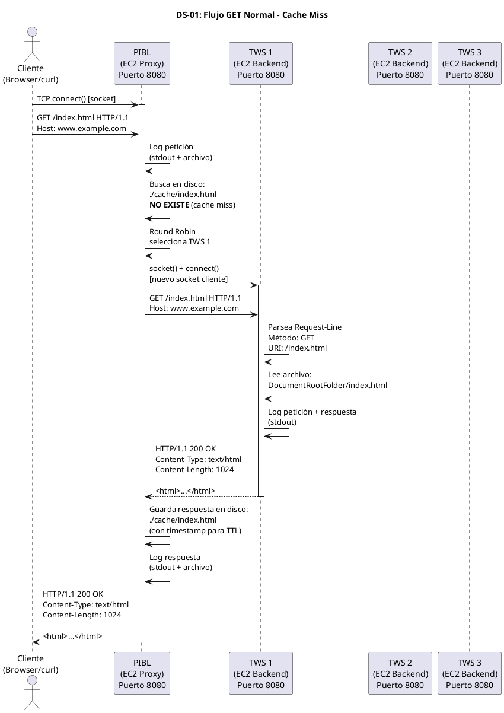
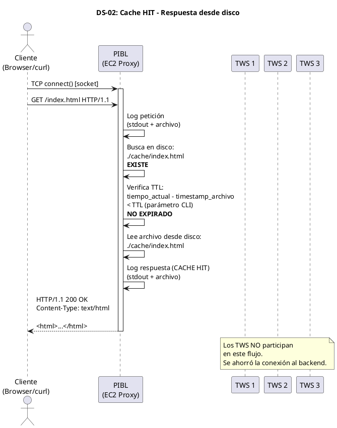
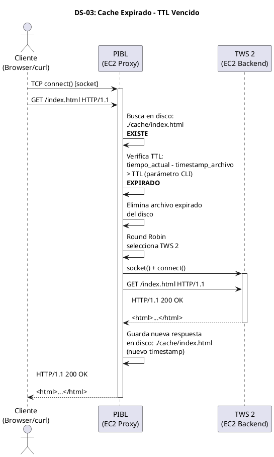
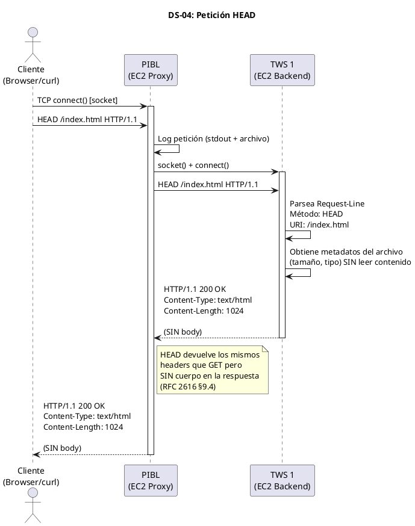
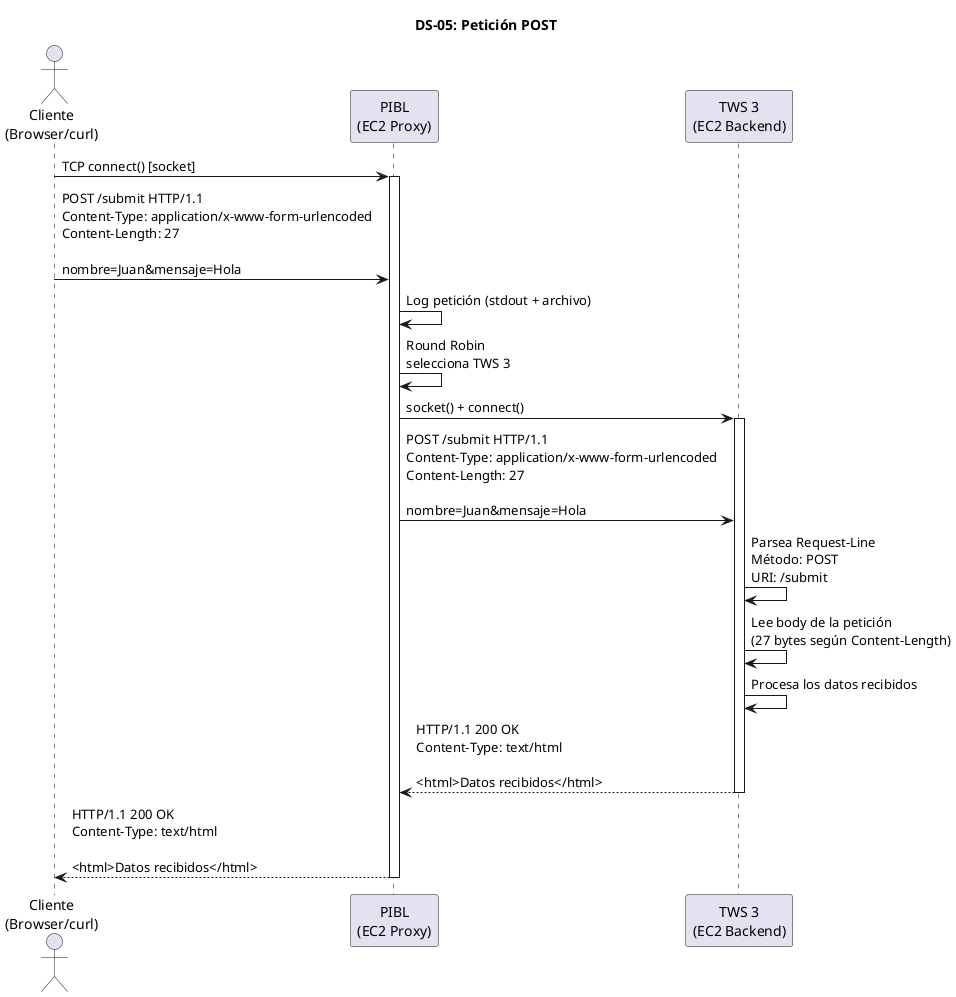
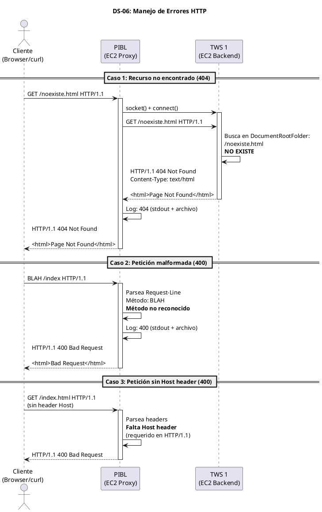

# Guía Completa del Proyecto - Cluster Web Telemática

## 1. Estructura de carpetas del proyecto

```
prueba-cluster/
│
├── README.md                          ← Entrega: Intro, Desarrollo, Conclusiones, Referencias
│
├── docs/                              ← Documentación y diagramas
│   ├── diagramas/
│   │   ├── DS-01-flujo-get-normal.puml
│   │   ├── DS-02-cache-hit.puml
│   │   ├── DS-03-cache-expirado-ttl.puml
│   │   ├── DS-04-peticion-head.puml
│   │   ├── DS-05-peticion-post.puml
│   │   ├── DS-06-errores-http.puml
│   │   └── DS-07-arquitectura-general.puml
│   └── arquitectura.png               ← Diagrama de despliegue AWS
│
├── pibl/                              ← Proxy Inverso + Balanceador de Carga
│   ├── Makefile
│   ├── pibl.conf                      ← Archivo de configuración (puerto + backends)
│   ├── cache/                         ← Directorio donde se almacenan recursos cacheados
│   ├── logs/                          ← Archivos de log
│   └── src/
│       ├── main.c                     ← Punto de entrada, parseo de args CLI
│       ├── server.c / server.h        ← Socket listener, accept, threads
│       ├── proxy.c / proxy.h          ← Lógica de reverse proxy (conectar al backend)
│       ├── balancer.c / balancer.h    ← Round Robin
│       ├── cache.c / cache.h          ← Caché en disco + TTL
│       ├── http_parser.c / http_parser.h  ← Parseo de HTTP request/response
│       ├── logger.c / logger.h        ← Log a stdout + archivo
│       └── config.c / config.h        ← Lectura del archivo de configuración
│
├── tws/                              ← Telematics Web Server
│   ├── Makefile
│   ├── logs/
│   └── src/
│       ├── main.c                     ← Punto de entrada: ./server <PORT> <LogFile> <DocRoot>
│       ├── server.c / server.h        ← Socket listener, accept, threads
│       ├── http_parser.c / http_parser.h  ← Parseo de GET, HEAD, POST
│       ├── http_response.c / http_response.h  ← Generar respuestas 200, 400, 404
│       ├── file_handler.c / file_handler.h    ← Servir archivos del DocumentRootFolder
│       └── logger.c / logger.h        ← Log a stdout + archivo
│
├── webapp/                            ← Aplicación web (la misma se replica en los 3 TWS)
│   ├── index.html                     ← Caso 1: hipertextos + 1 imagen
│   ├── gallery.html                   ← Caso 2: hipertextos + múltiples imágenes
│   ├── bigfile.html                   ← Caso 3: enlace a archivo de ~1MB
│   ├── multifiles.html                ← Caso 4: múltiples archivos ~1MB total
│   ├── css/
│   │   └── style.css
│   ├── img/
│   │   ├── logo.png
│   │   ├── photo1.jpg
│   │   ├── photo2.jpg
│   │   └── photo3.jpg
│   └── files/
│       ├── large_file.bin             ← ~1MB
│       ├── file_part1.bin             ← Varios archivos que suman ~1MB
│       ├── file_part2.bin
│       └── file_part3.bin
│
└── resources/                         ← PDF del proyecto y material de referencia
    └── PDF-ProyectoN1-PILB-WS-v1.0 (1).pdf
```

---

## 2. Requisitos funcionales (corregidos según el PDF)

### PIBL (Proxy Inverso + Balanceador de Carga)

| ID    | Requisito                                                        | Ref PDF      |
|-------|------------------------------------------------------------------|--------------|
| RF-01 | Escrito en C (o Rust) usando API Sockets                         | §5.1, §5.2   |
| RF-02 | Escuchar en puerto 80 u 8080 (configurable)                      | §5.5         |
| RF-03 | Al recibir petición, crear nuevo socket cliente hacia el backend elegido | §5.5   |
| RF-04 | Esperar respuesta del backend y reenviarla al cliente             | §5.6         |
| RF-05 | Concurrencia: manejar múltiples clientes con threads (pthreads)   | §5.3         |
| RF-06 | Soportar HTTP/1.1 (RFC 2616)                                     | §5.4         |
| RF-07 | Log: registrar peticiones y respuestas en stdout + archivo        | §5.7         |
| RF-08 | Caché en disco (directorio donde corre el PIBL)                   | §5.8a, §5.8b |
| RF-09 | TTL del caché: parámetro pasado al lanzar la aplicación           | §5.8c        |
| RF-10 | Balanceo de carga: Round Robin                                    | §5.9         |
| RF-11 | Archivo de configuración: puerto + lista de backends              | §5.10        |

### TWS (Telematics Web Server)

| ID    | Requisito                                                        | Ref PDF      |
|-------|------------------------------------------------------------------|--------------|
| RF-12 | Parsear métodos GET, HEAD, POST                                  | §5.a         |
| RF-13 | Código 200: petición exitosa                                     | §5.a.iii.1   |
| RF-14 | Código 400: petición no procesable                                | §5.a.iii.2   |
| RF-15 | Código 404: recurso no encontrado                                 | §5.a.iii.3   |
| RF-16 | Concurrencia con hilos (threads)                                  | §5.a.iv      |
| RF-17 | Logger: mostrar peticiones y respuestas en terminal               | §5.a.v       |
| RF-18 | CLI: `./server <HTTP PORT> <Log File> <DocumentRootFolder>`       | §5.a.vi      |
| RF-19 | Servir recursos desde DocumentRootFolder                          | §5.a.vi.2    |

---

## 3. Diagramas de secuencia (corregidos y completos)

### DS-01: Flujo GET normal (cache miss + Round Robin)



### DS-02: Cache HIT (lectura desde disco)



### DS-03: Cache expirado (TTL vencido)



### DS-04: Petición HEAD



### DS-05: Petición POST



### DS-06: Errores HTTP (400, 404)



---

## 4. Guía paso a paso para el proyecto

### Fase 1: TWS (Semana 1-2) — Empezar por aquí

El TWS es más simple que el PIBL y te da la base para todo lo demás. Muchos módulos se reutilizan.

#### Paso 1.1 — Socket TCP listener básico

```c
// tws/src/main.c
#include <stdio.h>
#include <stdlib.h>
#include <string.h>
#include <unistd.h>
#include <pthread.h>
#include <sys/socket.h>
#include <netinet/in.h>
#include <arpa/inet.h>

#define BUFFER_SIZE 8192

typedef struct {
    int client_fd;
    char client_ip[INET_ADDRSTRLEN];
    char *doc_root;
    char *log_file;
} client_context_t;

void *handle_client(void *arg);

int main(int argc, char *argv[]) {
    if (argc != 4) {
        fprintf(stderr, "Uso: %s <HTTP_PORT> <LogFile> <DocumentRootFolder>\n", argv[0]);
        return 1;
    }

    int port = atoi(argv[1]);
    char *log_file = argv[2];
    char *doc_root = argv[3];

    int server_fd = socket(AF_INET, SOCK_STREAM, 0);
    if (server_fd < 0) {
        perror("socket");
        return 1;
    }

    int opt = 1;
    setsockopt(server_fd, SOL_SOCKET, SO_REUSEADDR, &opt, sizeof(opt));

    struct sockaddr_in addr = {
        .sin_family = AF_INET,
        .sin_addr.s_addr = INADDR_ANY,
        .sin_port = htons(port)
    };

    if (bind(server_fd, (struct sockaddr *)&addr, sizeof(addr)) < 0) {
        perror("bind");
        close(server_fd);
        return 1;
    }

    if (listen(server_fd, 128) < 0) {
        perror("listen");
        close(server_fd);
        return 1;
    }

    printf("[TWS] Servidor escuchando en puerto %d\n", port);
    printf("[TWS] DocumentRoot: %s\n", doc_root);
    printf("[TWS] LogFile: %s\n", log_file);

    while (1) {
        struct sockaddr_in client_addr;
        socklen_t client_len = sizeof(client_addr);

        int client_fd = accept(server_fd, (struct sockaddr *)&client_addr, &client_len);
        if (client_fd < 0) {
            perror("accept");
            continue;
        }

        client_context_t *ctx = malloc(sizeof(client_context_t));
        ctx->client_fd = client_fd;
        ctx->doc_root = doc_root;
        ctx->log_file = log_file;
        inet_ntop(AF_INET, &client_addr.sin_addr, ctx->client_ip, sizeof(ctx->client_ip));

        pthread_t thread;
        pthread_create(&thread, NULL, handle_client, ctx);
        pthread_detach(thread);
    }

    close(server_fd);
    return 0;
}
```

#### Paso 1.2 — Handler del cliente con parseo HTTP + GET/HEAD/POST

```c
// tws/src/main.c (continuación - función handle_client)

void *handle_client(void *arg) {
    client_context_t *ctx = (client_context_t *)arg;
    char buffer[BUFFER_SIZE];

    ssize_t n = read(ctx->client_fd, buffer, sizeof(buffer) - 1);
    if (n <= 0) {
        close(ctx->client_fd);
        free(ctx);
        return NULL;
    }
    buffer[n] = '\0';

    /* Parsear Request-Line: METHOD URI VERSION */
    char method[8], uri[2048], version[16];
    if (sscanf(buffer, "%7s %2047s %15s", method, uri, version) != 3) {
        char *resp = "HTTP/1.1 400 Bad Request\r\nContent-Length: 11\r\n\r\nBad Request";
        write(ctx->client_fd, resp, strlen(resp));
        close(ctx->client_fd);
        free(ctx);
        return NULL;
    }

    /* Log a stdout */
    printf("[TWS] %s -> %s %s %s\n", ctx->client_ip, method, uri, version);

    /* Construir ruta completa del archivo */
    char filepath[4096];
    if (strcmp(uri, "/") == 0)
        snprintf(filepath, sizeof(filepath), "%s/index.html", ctx->doc_root);
    else
        snprintf(filepath, sizeof(filepath), "%s%s", ctx->doc_root, uri);

    /* Verificar si el archivo existe */
    FILE *file = fopen(filepath, "rb");
    if (!file) {
        char *resp = "HTTP/1.1 404 Not Found\r\n"
                     "Content-Type: text/html\r\n"
                     "Content-Length: 44\r\n"
                     "\r\n"
                     "<html><body>404 - Not Found</body></html>";
        write(ctx->client_fd, resp, strlen(resp));
        printf("[TWS] %s <- 404 Not Found (%s)\n", ctx->client_ip, uri);
        close(ctx->client_fd);
        free(ctx);
        return NULL;
    }

    /* Obtener tamaño del archivo */
    fseek(file, 0, SEEK_END);
    long file_size = ftell(file);
    fseek(file, 0, SEEK_SET);

    /* Determinar Content-Type básico */
    const char *content_type = "application/octet-stream";
    if (strstr(uri, ".html")) content_type = "text/html";
    else if (strstr(uri, ".css")) content_type = "text/css";
    else if (strstr(uri, ".js")) content_type = "application/javascript";
    else if (strstr(uri, ".png")) content_type = "image/png";
    else if (strstr(uri, ".jpg")) content_type = "image/jpeg";
    else if (strstr(uri, ".gif")) content_type = "image/gif";

    /* Enviar headers */
    char header[512];
    int header_len = snprintf(header, sizeof(header),
        "HTTP/1.1 200 OK\r\n"
        "Content-Type: %s\r\n"
        "Content-Length: %ld\r\n"
        "\r\n",
        content_type, file_size);

    write(ctx->client_fd, header, header_len);

    /* GET: enviar body | HEAD: solo headers (ya enviados) */
    if (strcmp(method, "GET") == 0 || strcmp(method, "POST") == 0) {
        char file_buf[4096];
        size_t bytes;
        while ((bytes = fread(file_buf, 1, sizeof(file_buf), file)) > 0) {
            write(ctx->client_fd, file_buf, bytes);
        }
    }
    /* HEAD: no envía body, solo los headers de arriba */

    printf("[TWS] %s <- 200 OK %s (%ld bytes)\n", ctx->client_ip, uri, file_size);

    fclose(file);
    close(ctx->client_fd);
    free(ctx);
    return NULL;
}
```

#### Paso 1.3 — Compilar y probar

```bash
cd tws
gcc -o server src/main.c -lpthread -Wall -Wextra
./server 8080 logs/tws.log ../webapp
```

Probar:

```bash
curl -v http://localhost:8080/index.html
curl -I http://localhost:8080/index.html       # HEAD
curl -X POST http://localhost:8080/submit      # POST
curl http://localhost:8080/noexiste.html        # 404
```

---

### Fase 2: PIBL - Proxy básico (Semana 2-3)

#### Paso 2.1 — Proxy que reenvía a un solo backend (sin balanceo aún)

```c
// pibl/src/main.c - estructura base
// Similar a TWS pero en handle_client:
// 1. Recibe petición del cliente
// 2. Crea socket NUEVO hacia el backend
// 3. Envía la petición al backend
// 4. Lee la respuesta del backend
// 5. Envía la respuesta al cliente

// La parte clave del proxy:
void proxy_forward(int client_fd, const char *backend_host, int backend_port,
                   const char *request, size_t request_len) {

    /* Crear socket hacia el backend */
    int backend_fd = socket(AF_INET, SOCK_STREAM, 0);

    struct sockaddr_in backend_addr = {
        .sin_family = AF_INET,
        .sin_port = htons(backend_port)
    };
    inet_pton(AF_INET, backend_host, &backend_addr.sin_addr);

    if (connect(backend_fd, (struct sockaddr *)&backend_addr, sizeof(backend_addr)) < 0) {
        char *err = "HTTP/1.1 502 Bad Gateway\r\nContent-Length: 11\r\n\r\nBad Gateway";
        write(client_fd, err, strlen(err));
        close(backend_fd);
        return;
    }

    /* Enviar petición del cliente al backend */
    write(backend_fd, request, request_len);

    /* Leer respuesta del backend y reenviarla al cliente */
    char buffer[8192];
    ssize_t n;
    while ((n = read(backend_fd, buffer, sizeof(buffer))) > 0) {
        write(client_fd, buffer, n);
    }

    close(backend_fd);
}
```

#### Paso 2.2 — Round Robin

```c
// pibl/src/balancer.c

typedef struct {
    char host[256];
    int port;
} backend_t;

typedef struct {
    backend_t *backends;
    int count;
    int current;             // índice Round Robin
    pthread_mutex_t lock;
} balancer_t;

backend_t *balancer_next(balancer_t *lb) {
    pthread_mutex_lock(&lb->lock);
    backend_t *b = &lb->backends[lb->current];
    lb->current = (lb->current + 1) % lb->count;
    pthread_mutex_unlock(&lb->lock);
    return b;
}
```

#### Paso 2.3 — Archivo de configuración

```
# pibl/pibl.conf
port=8080
backend=10.0.1.10:8080
backend=10.0.1.11:8080
backend=10.0.1.12:8080
```

---

### Fase 3: Caché en disco + TTL (Semana 3-4)

```c
// pibl/src/cache.c - lógica principal
#include <sys/stat.h>
#include <time.h>

int cache_is_valid(const char *cache_path, int ttl_seconds) {
    struct stat st;
    if (stat(cache_path, &st) != 0)
        return 0;  /* no existe */

    time_t now = time(NULL);
    double age = difftime(now, st.st_mtime);

    return age < ttl_seconds;  /* 1 = válido, 0 = expirado */
}

/* Convertir URI a ruta de caché: /index.html → ./cache/index.html */
void cache_path_from_uri(const char *uri, char *out, size_t out_size) {
    snprintf(out, out_size, "./cache%s", uri);
}
```

Lanzamiento con TTL:

```bash
./pibl --config pibl.conf --ttl 60
```

---

### Fase 4: Logger dual (Semana 3-4)

```c
// pibl/src/logger.c
#include <stdio.h>
#include <stdarg.h>
#include <time.h>
#include <pthread.h>

static FILE *log_fp = NULL;
static pthread_mutex_t log_lock = PTHREAD_MUTEX_INITIALIZER;

void logger_init(const char *filepath) {
    log_fp = fopen(filepath, "a");
}

void logger_log(const char *fmt, ...) {
    pthread_mutex_lock(&log_lock);

    time_t now = time(NULL);
    char time_str[64];
    strftime(time_str, sizeof(time_str), "%Y-%m-%d %H:%M:%S", localtime(&now));

    va_list args;

    /* Escribir a stdout */
    printf("[%s] ", time_str);
    va_start(args, fmt);
    vprintf(fmt, args);
    va_end(args);
    printf("\n");

    /* Escribir a archivo */
    if (log_fp) {
        fprintf(log_fp, "[%s] ", time_str);
        va_start(args, fmt);
        vfprintf(log_fp, fmt, args);
        va_end(args);
        fprintf(log_fp, "\n");
        fflush(log_fp);
    }

    pthread_mutex_unlock(&log_lock);
}
```

---

### Fase 5: Webapp + casos de prueba (Semana 4)

Crear las 4 páginas de prueba en `webapp/`.

---

### Fase 6: Despliegue en AWS (Semana 4-5)

```
EC2 Instance 1: PIBL          (IP pública, puerto 8080)
EC2 Instance 2: TWS 1         (IP privada, puerto 8080)
EC2 Instance 3: TWS 2         (IP privada, puerto 8080)
EC2 Instance 4: TWS 3         (IP privada, puerto 8080)
```

---

### Fase 7: Documentación + README.md (Semana 5)

---

## 5. Orden de implementación recomendado

### Semana 1 (Mar 26 - Abr 1)

```
├── Persona A: TWS socket + threads + GET
├── Persona B: HTTP parser (Request-Line + headers)
└── Persona C: Webapp (4 páginas de prueba) + estructura del proyecto
```

### Semana 2 (Abr 2 - Abr 8)

```
├── Persona A: TWS completo (HEAD, POST, 400, 404)
├── Persona B: PIBL socket + proxy básico (forward a 1 backend)
└── Persona C: Logger (stdout + archivo) compartido TWS/PIBL
```

### Semana 3 (Abr 9 - Abr 15)

```
├── Persona A: PIBL Round Robin + archivo de configuración
├── Persona B: PIBL Caché en disco + TTL
└── Persona C: Testing local (curl, telnet, browser)
```

### Semana 4 (Abr 16 - Abr 22)

```
├── Todos: Despliegue en AWS EC2 (4 instancias)
├── Todos: Testing en AWS con los 4 casos de prueba
└── Todos: Fix bugs
```

### Semana 5 (Abr 23 - May 6)

```
├── Todos: README.md (Introducción, Desarrollo, Conclusiones, Referencias)
├── Todos: Diagramas finales
└── Todos: Preparar sustentación (40 min)
```

---

## 6. Primer comando para empezar ahora

Cuando estés listo para empezar a codificar, cambia a modo Agent y te ayudo a crear toda la estructura de carpetas y el código base del TWS. El primer paso concreto sería:

1. **Crear la estructura de carpetas**
2. **Crear `tws/src/main.c`** con el socket + threads + parseo GET
3. **Crear `webapp/index.html`** básico para probar
4. **Compilar y probar con curl**

Todo lo anterior son las piezas del código que te mostré arriba, pero integradas correctamente con los Makefiles y la estructura del proyecto.
